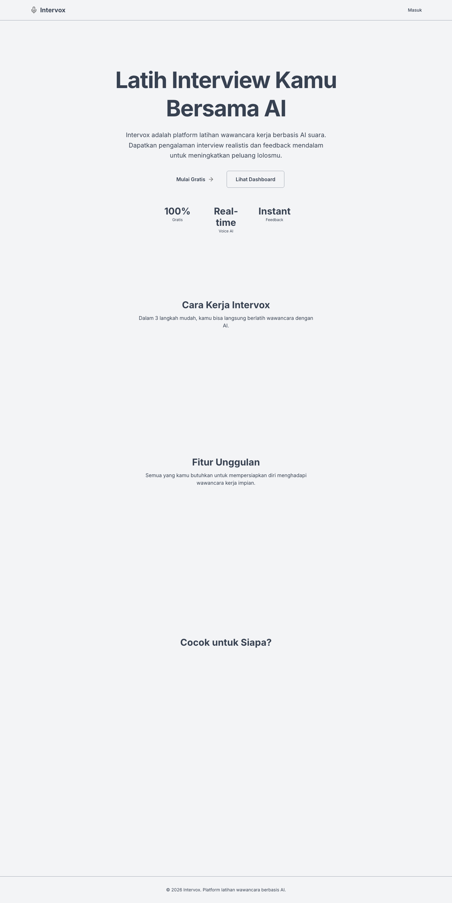
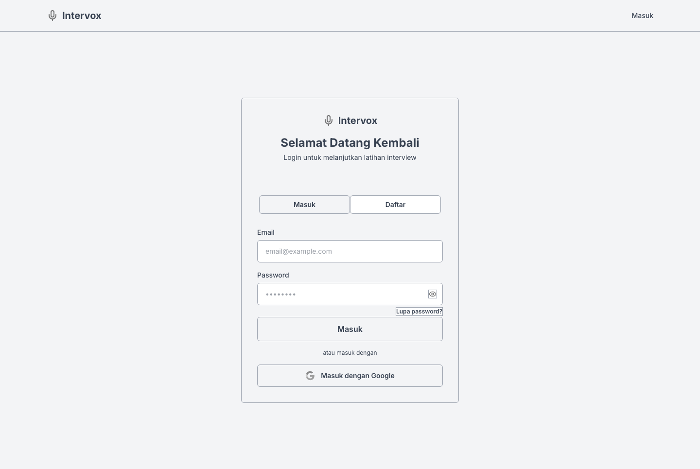
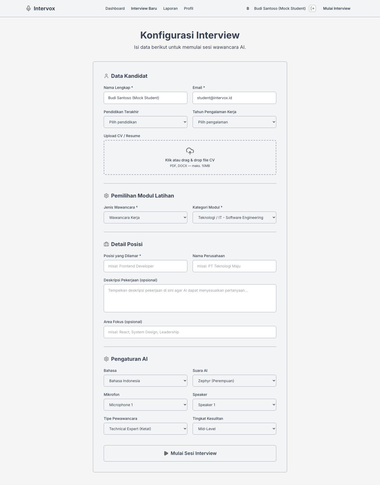
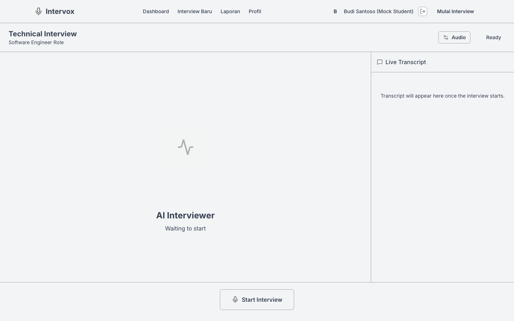
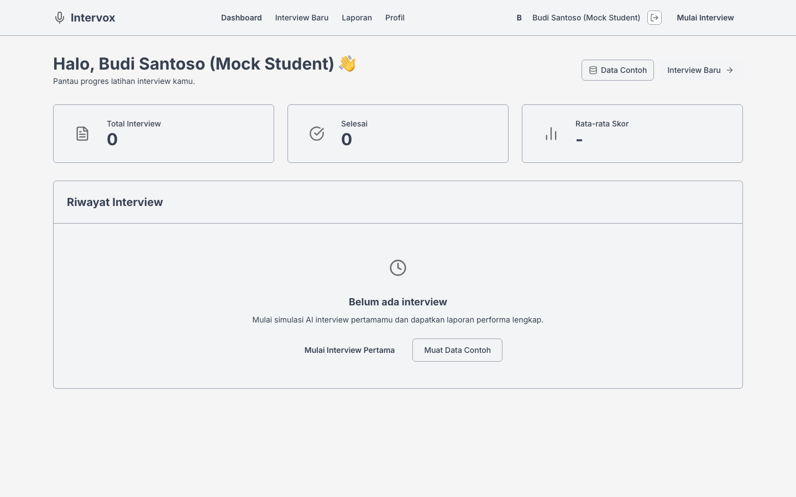

# PRESENTASI SKRIPSI — INTERVOX

## Format: 12 Slide / ±8 Menit

---

# SLIDE 1 — COVER

**SISTEM CERDAS VIRTUAL INTERVIEW COACH BERBASIS AI DENGAN FITUR ANALISIS EKSPRESI, JAWABAN, DAN PENILAIAN WAWANCARA MAHASISWA**

- **Nama:** Gusti Randa
- **NPM:** 2210010236
- **Program Studi:** Teknik Informatika
- **Fakultas:** Teknologi Informasi
- **Universitas:** Islam Kalimantan Muhammad Arsyad Al Banjari (UNISKA)
- **Tahun:** 2026

---

# SLIDE 2 — LATAR BELAKANG & PERMASALAHAN

**Kondisi Objek Penelitian:**

- Mahasiswa tingkat akhir FTI UNISKA membutuhkan kesiapan wawancara kerja yang memadai
- Proses latihan masih konvensional — hanya bisa berlatih saat dosen pembimbing tersedia
- Evaluasi bersifat lisan, subjektif, tanpa metrik terukur dan tidak terdokumentasi

**Permasalahan Utama:**

- Tidak ada media simulasi wawancara interaktif dan real-time
- Tidak ada evaluasi objektif terhadap kualitas jawaban dan komunikasi non-verbal
- Tidak ada rekam jejak perkembangan yang bisa ditinjau kembali

**Alasan Penelitian Perlu Dilakukan:**

- Penelitian terdahulu belum mengintegrasikan simulasi real-time, evaluasi multi-kriteria (metode STAR), analisis ekspresi wajah, dan pelaporan komprehensif dalam satu platform
- Kebutuhan peningkatan employability lulusan melalui inovasi pembelajaran berbasis AI

---

# SLIDE 3 — RUMUSAN MASALAH, TUJUAN & BATASAN

**Rumusan Masalah:**

1. Bagaimana merancang dan mengembangkan aplikasi Intervox berbasis real-time conversational AI?
2. Bagaimana mengimplementasikan mekanisme analisis dan evaluasi performa wawancara secara terstruktur?
3. Bagaimana menghasilkan laporan komprehensif untuk monitoring perkembangan mahasiswa?
4. Bagaimana menilai kelayakan fungsional sistem berdasarkan pengujian?

**Tujuan Penelitian:**

1. Mengembangkan Intervox sebagai media latihan wawancara berbasis AI real-time
2. Mengimplementasikan evaluasi otomatis dengan metode STAR + analisis ekspresi wajah
3. Menyediakan 21 laporan PDF berkop universitas untuk semua role
4. Menguji kelayakan fungsional dengan black-box testing

**Batasan Penelitian:**

- Fokus pada software engineering (bukan psikologi klinis)
- 4 role pengguna: Student, Lecturer, Administrator, Dean
- 10 tabel database, 18 form input, 21 laporan output
- Pengujian terbatas pada fungsional (black-box)

---

# SLIDE 4 — PENELITIAN TERKAIT & RESEARCH GAP

| No | Peneliti | Topik | Hasil | Keterbatasan |
| ---- | ---------- | ------- | ------- | -------------- |
| 1 | Pratama & Sari (2022) | Chatbot persiapan wawancara | Latihan tanya jawab dasar | Tidak real-time, tanpa analisis mendalam |
| 2 | Nurfadilah (2023) | E-learning soft skill karier | Materi terstruktur | Tidak ada simulasi percakapan langsung |
| 3 | Rahman et al. (2024) | Penilaian jawaban berbasis teks | Otomatisasi skoring | Tidak mengelola sesi end-to-end |
| 4 | Hidayat & Lestari (2024) | Monitoring latihan mahasiswa | Dashboard perkembangan | Tidak fokus wawancara AI |

**Research Gap → Intervox:**

- ✅ Simulasi wawancara real-time voice-to-voice
- ✅ Analisis ekspresi wajah (7 emosi) via webcam
- ✅ Evaluasi multi-kriteria metode STAR
- ✅ Pelaporan komprehensif 21 jenis + sertifikat
- ✅ Multi-role access (4 level hierarki)

---

# SLIDE 5 — ANALISIS SISTEM YANG SEDANG BERJALAN (SISTEM LAMA)

**Proses Latihan Wawancara Saat Ini:**

1. Mahasiswa mencari pertanyaan sendiri secara manual
2. Berlatih menjawab tanpa simulator / hanya dengan teman
3. Meminta masukan terbatas dari dosen (jika tersedia)
4. Evaluasi tidak terstruktur, tidak terdokumentasi
5. Tidak ada rekap histori perkembangan

**Permasalahan Sistem Lama:**

- ❌ Latihan hanya bisa dilakukan saat dosen tersedia
- ❌ Evaluasi lisan, subjektif, tanpa rubrik standar
- ❌ Tidak ada data kuantitatif performa mahasiswa
- ❌ Tidak ada umpan balik terhadap komunikasi non-verbal
- ❌ Tidak ada laporan untuk pengambilan keputusan institusi

---

# SLIDE 6 — SISTEM USULAN (SISTEM BARU)

**Proses pada Sistem Intervox:**

1. User registrasi/login → verifikasi admin
2. Student memilih modul & parameter sesi
3. Sistem menjalankan sesi wawancara AI real-time (voice-to-voice) + deteksi ekspresi wajah
4. AI menganalisis jawaban dengan metode STAR di akhir sesi
5. Dosen/Pakar memvalidasi hasil (Expert Verification)
6. Student mengakses laporan akhir + rekomendasi pengembangan

**Perbandingan Sistem Lama vs Baru:**

| Aspek | Sistem Lama | Intervox |
| ------- | ------------- | ---------- |
| Media latihan | Manual/teman | AI Voice real-time |
| Evaluasi | Lisan, subjektif | Multi-kriteria STAR (5 dimensi) |
| Ekspresi wajah | Tidak dianalisis | 7 emosi terdeteksi real-time |
| Dokumentasi | Tidak ada | 21 laporan PDF + sertifikat |
| Aksesibilitas | Tergantung dosen | 24/7, mandiri |
| Peran pengguna | 1 (mahasiswa) | 4 (Student, Lecturer, Admin, Dean) |

---

# SLIDE 7 — PERANCANGAN SISTEM (DFD)

**DFD Level 0 (Context Diagram):**

- 5 entitas: Student, Administrator, Lecturer, Dean, AI Engine
- 1 proses utama: Sistem Intervox

**DFD Level 1 — 5 Proses Utama:**

1. Manajemen Pengguna (Registrasi, Login, Profil, Verifikasi)
2. Konfigurasi Wawancara (Kategori, Bank Soal, Kriteria)
3. Pelaksanaan Wawancara (Real-time AI + Ekspresi Wajah)
4. Analisis AI (STAR, Scoring, Rekomendasi)
5. Pelaporan & Dashboard (21 Laporan, Sertifikat, Statistik)

**4 Data Store:**

- D1. Users & Profiles
- D2. Master Data (Kategori, Soal, Kriteria)
- D3. Interview Sessions (Sesi + Log Percakapan)
- D4. Analysis Results (Skor + Rekomendasi)

**DFD Level 2 — Pelaksanaan Wawancara:**

- 3.1 Inisialisasi Sesi → 3.2 Perekaman Tanya Jawab → 3.3 Analisis Ekspresi → 3.4 Finalisasi Sesi

**DFD Level 3 — Analisis AI:**

- 4.1 Persiapan Prompt → 4.2 Eksekusi LLM API → 4.3 Pemrosesan Skor → 4.4 Rekomendasi → 4.5 Verifikasi Pakar

*(Sisipkan gambar DFD dari export Mermaid — lihat file `dfd.md`)*

---

# SLIDE 8 — RANCANGAN ANTARMUKA MASUKAN & KELUARAN

**18 Form Input (Masukan):**

| No | Form | Aktor |
| ---- | ------ | ------- |
| 1 | Login & Registrasi | Semua |
| 2 | Lupa Password | Semua |
| 3 | Edit Profil + CV | Student |
| 4 | Ganti Password | Semua |
| 5 | Konfigurasi Simulasi Wawancara | Student |
| 6 | Sesi Simulasi (Voice AI + Webcam) | Student |
| 7 | Penilaian Diri & Umpan Balik | Student |
| 8 | Manajemen Kategori Modul | Admin |
| 9 | Bank Pertanyaan | Admin |
| 10 | Kriteria Penilaian STAR | Admin |
| 11 | Data Dosen | Admin |
| 12 | Verifikasi Pengguna | Admin |
| 13 | Pengaturan Sistem | Admin |
| 14 | Bank Soal Wawancara | Lecturer |
| 15 | Kategori Baru | Lecturer |
| 16 | Validasi Pakar | Lecturer/Dean |
| 17 | Filter Laporan | Semua |
| 18 | Export PDF/Excel | Semua |

**21 Laporan Output (Keluaran):**

- Student: Transkrip, Evaluasi Skor, Kekuatan/Kelemahan, Perbandingan Jawaban, Grafik Perkembangan, Rekomendasi, Sertifikat (7)
- Lecturer: Penggunaan Bank Soal, Ringkasan Kompetensi, Analisis Kesalahan, Evaluasi Kesulitan, Presensi Latihan, Ringkasan Pembimbingan (6)
- Admin: Partisipan Aktif, Statistik Modul, Analisis Kesulitan, Statistik Sistem, Umpan Balik (5)
- Dean: Partisipan Aktif, Statistik Modul, Statistik Sistem (3)

---

# SLIDE 9 — IMPLEMENTASI / HASIL ANTARMUKA

**Screenshot Utama (6 tampilan):**

1. **Landing Page & Login**
   
   

2. **Sesi Interview AI (Fitur Inti)**
   
   

3. **Dashboard & Laporan**
   
   

**Fitur Utama yang Terimplementasi:**

- Voice-to-Voice AI Interview (Google Gemini)
- Deteksi 7 ekspresi wajah real-time (face-api.js)
- Evaluasi metode STAR (5 dimensi skor)
- 21 laporan PDF berkop universitas
- Multi-role dashboard (4 level)
- Account verification system
- Bank soal custom per dosen

**Tech Stack:**
Next.js + React + TypeScript | Supabase (PostgreSQL) | Google Gemini AI | face-api.js | Tailwind CSS

---

# SLIDE 10 — PENGUJIAN & HASIL

**Metode Pengujian:** Black Box Testing

**Ruang Lingkup:**

- 18 form masukan
- 3 jenis data uji per skenario: valid, tidak valid, kosong
- Semua role diuji (Student, Lecturer, Administrator, Dean)

**Skenario & Hasil:**

| No | Form yang Diuji | Jumlah Skenario | Valid | Tidak Valid |
| ---- | ----------------- | :-: | :-: | :-: |
| 1 | Form Login | 8 | 8 | 0 |
| 2 | Form Registrasi | 7 | 7 | 0 |
| 3 | Form Lupa Password | 4 | 4 | 0 |
| 4 | Form Edit Profil | 7 | 7 | 0 |
| 5 | Form Ganti Password | 8 | 8 | 0 |
| 6 | Form Konfigurasi Simulasi | 10 | 10 | 0 |
| 7 | Form Sesi Wawancara | 6 | 6 | 0 |
| 8 | Form Penilaian Diri | 6 | 6 | 0 |
| 9–14 | Form Manajemen (Admin) | 37 | 37 | 0 |
| 15–16 | Form Bank Soal (Lecturer) | 11 | 11 | 0 |
| 17 | Form Validasi Pakar | 5 | 5 | 0 |
| 18 | Form Filter Laporan | 6 | 6 | 0 |
| | **TOTAL** | **115** | **115** | **0** |

**Hasil: ✅ 115/115 skenario VALID — Persentase keberhasilan 100%**

---

# SLIDE 11 — KESIMPULAN

1. **Intervox berhasil dikembangkan** sebagai platform virtual interview coach berbasis real-time conversational AI dengan integrasi analisis ekspresi wajah, dibangun menggunakan Next.js, Supabase, dan Google Gemini API.

2. **Evaluasi performa terimplementasi** secara otomatis menggunakan metode STAR dengan 5 dimensi penilaian (Communication, Technical, Problem Solving, Culture Fit, Expression) — ditambah mekanisme validasi pakar oleh dosen.

3. **21 laporan PDF komprehensif** berkop universitas berhasil dihasilkan untuk 4 role, mendukung pemetaan kekuatan/kelemahan dan rekomendasi pengembangan diri mahasiswa.

4. **Pengujian black-box** terhadap 18 form dengan 115 skenario menghasilkan **persentase keberhasilan 100%** — seluruh fungsi berjalan sesuai rancangan.

*(Setiap kesimpulan menjawab rumusan masalah 1–4)*

---

# SLIDE 12 — SARAN & PENUTUP

**Saran Pengembangan:**

1. Penambahan pengujian validitas AI — membandingkan skor sistem dengan penilaian dosen/HRD sebagai pakar
2. Penyempurnaan fitur CRUD lengkap pada modul manajemen (edit & hapus bank soal, kategori, kriteria)
3. Peningkatan keamanan data (Row Level Security, audit log, enkripsi berkas CV)
4. Pengembangan fitur body language analysis (gestur tangan, postur tubuh) dan multi-bahasa

---

**Terima Kasih**

Gusti Randa — 2210010236
Teknik Informatika, FTI UNISKA MAB

---

## CATATAN UNTUK PEMBUATAN SLIDE

### Gambar yang perlu disisipkan

- **Slide 7:** Export diagram DFD dari file `dfd.md` (gunakan <https://mermaid.live>)
- **Slide 9:** Ambil dari folder `wireframes/`:
  - `01-general-landing.png` (Landing Page)
  - `02-general-auth-signin.png` (Login)
  - `06-student-interview-setup.png` (Setup Interview)
  - `07-student-interview-session.png` (Sesi AI)
  - `04-student-dashboard.png` (Dashboard)
  - `26-report-student-score-evaluation.png` (Laporan Skor)

### Tips format slide

- 1 slide = 1 fokus, gunakan poin singkat
- Tabel penelitian terkait (Slide 4) harus muat 1 slide
- Screenshot (Slide 9) susun 2x3 grid agar semua terlihat jelas
- Slide 10 pakai tabel ringkas, highlight angka 100%
