# BAB III

# ANALISIS DAN PERANCANGAN SISTEM

## 3.1 Analisis Sistem yang Berjalan

Saat ini, proses persiapan dan evaluasi kesiapan wawancara kerja mahasiswa tingkat akhir di lingkungan Universitas Islam Kalimantan (UNISKA) masih dilakukan secara konvensional (manual). Proses dimulai ketika mahasiswa yang hendak mempersiapkan diri menghadapi wawancara kerja meminta bantuan kepada dosen pembimbing, rekan sesama mahasiswa, atau melakukan latihan mandiri di depan cermin. Evaluasi terhadap kualitas jawaban, ekspresi wajah, dan kesiapan mental mahasiswa dilakukan secara subjektif tanpa adanya metrik yang terukur dan standar baku. Tidak ada media yang dapat merekam, menganalisis, dan memberikan umpan balik secara objektif dan komprehensif terhadap performa wawancara mahasiswa.

Analisis sistem ini bertujuan untuk mengidentifikasi kelemahan-kelemahan pada proses konvensional (sistem lama) serta merancang solusi sistem cerdas yang mampu meningkatkan efektivitas, efisiensi, dan objektivitas dalam pelatihan simulasi wawancara kerja mahasiswa.

### 3.1.1 Analisis Sistem Lama (Interview Manual)

Alur sistem lama untuk proses pelatihan dan evaluasi wawancara kerja mahasiswa secara manual dapat dilihat pada flowchart berikut:

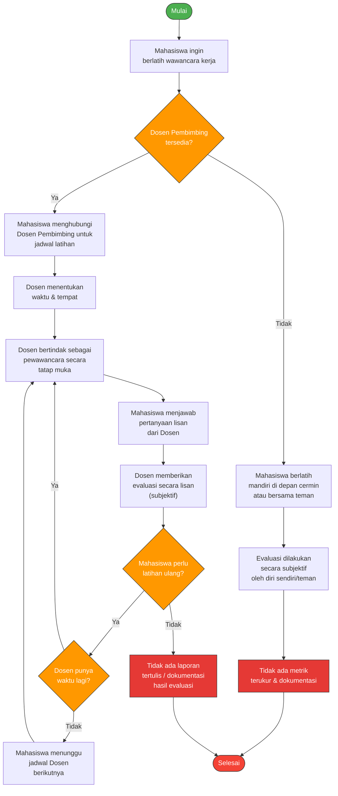

**Gambar 3.1** Flowchart Sistem Lama (Interview Manual)

Berdasarkan flowchart di atas, alur proses pelatihan wawancara kerja mahasiswa pada sistem lama (konvensional) adalah sebagai berikut:

1. **Mahasiswa** yang ingin mempersiapkan diri menghadapi wawancara kerja harus terlebih dahulu menghubungi **Dosen Pembimbing** untuk meminta waktu latihan simulasi wawancara.
2. Jika Dosen Pembimbing tidak tersedia, mahasiswa hanya dapat berlatih sendiri (di depan cermin) atau bersama rekan tanpa evaluasi yang terstruktur.
3. Jika Dosen Pembimbing bersedia, dosen akan bertindak sebagai pewawancara secara tatap muka satu per satu (_one-on-one_) di ruangan tertentu.
4. Mahasiswa menjawab pertanyaan-pertanyaan yang diajukan dosen secara lisan.
5. Setelah sesi latihan selesai, dosen memberikan evaluasi secara lisan yang bersifat **subjektif** — tidak ada skor kuantitatif, tidak ada dokumentasi tertulis, dan tidak ada rekam jejak yang dapat ditinjau ulang.
6. Jika mahasiswa memerlukan latihan ulang, ia harus menunggu kembali jadwal Dosen Pembimbing yang sangat terbatas.
7. Proses berakhir tanpa adanya **laporan tertulis**, **metrik performa**, maupun **sertifikat latihan** yang dapat digunakan sebagai bukti kesiapan mahasiswa.

#### Kelemahan Sistem Lama

| No  | Kelemahan                                         | Dampak                                                                                   |
| :-: | :------------------------------------------------ | :--------------------------------------------------------------------------------------- |
|  1  | Ketergantungan pada ketersediaan Dosen Pembimbing | Mahasiswa tidak dapat berlatih kapan saja, harus menunggu jadwal dosen                   |
|  2  | Evaluasi bersifat subjektif dan tidak terukur     | Tidak ada standar baku penilaian; hasil evaluasi berbeda antar dosen                     |
|  3  | Tidak ada dokumentasi/rekam jejak                 | Mahasiswa tidak memiliki bukti latihan atau catatan progres                              |
|  4  | Skalabilitas sangat rendah                        | Satu dosen hanya mampu menangani satu mahasiswa pada satu waktu                          |
|  5  | Tidak ada analisis ekspresi wajah                 | Aspek _body language_ dan ekspresi hanya dinilai secara kasual                           |
|  6  | Tidak ada bank soal terstandar                    | Pertanyaan bergantung pada ingatan dan preferensi dosen saat itu                         |
|  7  | Tidak ada laporan resmi untuk portofolio          | Mahasiswa tidak memiliki sertifikat atau laporan evaluasi untuk melengkapi lamaran kerja |

---

### 3.1.2 Sistem Usulan Baru (Sistem Intervox)

Sistem usulan baru **Intervox** adalah platform berbasis web yang memanfaatkan teknologi **Artificial Intelligence (AI)** untuk mensimulasikan proses wawancara kerja secara interaktif menggunakan suara (_voice-to-voice_) dan analisis ekspresi wajah melalui kamera (_webcam_). Sistem ini dirancang untuk diakses oleh 3 jenis pengguna (aktor): **Mahasiswa (Student)**, **Dosen Pembimbing (Lecturer)**, dan **Administrator (Admin)**.

Alur sistem usulan baru dapat dilihat pada flowchart berikut:

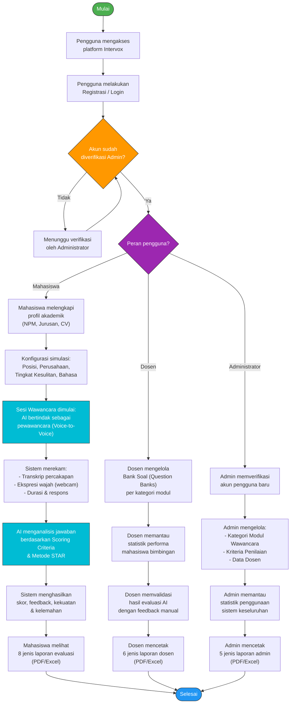

**Gambar 3.2** Flowchart Sistem Usulan Baru (Intervox)

Berdasarkan flowchart di atas, alur proses pada sistem usulan baru Intervox adalah sebagai berikut:

1. **Pengguna** mengakses platform Intervox melalui _web browser_ dan melakukan registrasi atau login.
2. Akun baru harus melalui proses **verifikasi** oleh Administrator sebelum dapat menggunakan fitur sistem.
3. Setelah terverifikasi, pengguna diarahkan ke dashboard sesuai perannya (Mahasiswa, Dosen, atau Administrator).
4. **Mahasiswa** dapat langsung mengonfigurasi simulasi wawancara (memilih posisi, perusahaan, tingkat kesulitan) dan memulai sesi wawancara interaktif dengan AI yang berperan sebagai pewawancara secara _voice-to-voice_. Sistem secara otomatis merekam transkrip percakapan dan menganalisis ekspresi wajah melalui webcam.
5. Setelah sesi selesai, **AI** menganalisis jawaban mahasiswa berdasarkan kriteria penilaian (_Scoring Criteria_) yang telah ditetapkan, menghasilkan skor kuantitatif, feedback naratif, serta identifikasi kekuatan dan kelemahan kandidat.
6. **Dosen Pembimbing** dapat mengelola Bank Soal, memantau progres mahasiswa bimbingannya, dan memvalidasi hasil evaluasi AI.
7. **Administrator** mengelola konfigurasi sistem, verifikasi pengguna, kategori modul, kriteria penilaian, dan memantau statistik penggunaan platform secara keseluruhan.
8. Seluruh aktor dapat mencetak **laporan evaluasi resmi** dalam format PDF/Excel dengan kop surat universitas.

#### Keunggulan Sistem Usulan Baru

| No  | Keunggulan                                    | Penjelasan                                                                              |
| :-: | :-------------------------------------------- | :-------------------------------------------------------------------------------------- |
|  1  | Tersedia 24/7 tanpa bergantung jadwal dosen   | Mahasiswa dapat berlatih kapan saja dan di mana saja                                    |
|  2  | Evaluasi objektif dan terukur berdasarkan AI  | Skor kuantitatif berdasarkan 4 metrik: Komunikasi, Teknis, Problem Solving, Culture Fit |
|  3  | Dokumentasi lengkap dan rekam jejak tersimpan | Seluruh transkrip, skor, dan evaluasi tercatat dalam database                           |
|  4  | Skalabilitas tinggi                           | Ratusan mahasiswa dapat berlatih secara bersamaan                                       |
|  5  | Analisis ekspresi wajah melalui kamera        | Evaluasi aspek non-verbal secara otomatis                                               |
|  6  | Bank soal terstandar oleh Dosen               | Pertanyaan sesuai kurikulum dan modul yang telah disusun dosen                          |
|  7  | 18 jenis laporan resmi untuk portofolio       | Laporan dengan kop surat kampus yang dapat dicetak dan dilampirkan saat melamar kerja   |

---

## 3.2 Data Flow Diagram (DFD)

Pemodelan **Data Flow Diagram (DFD)** sistem Intervox disusun mulai dari Level 0 (Context Diagram) hingga Level 4 untuk menggambarkan aliran data secara detail pada setiap proses dalam sistem.

### 3.2.1 DFD Level 0 (Context Diagram)

Diagram konteks menggambarkan interaksi sistem secara keseluruhan dengan entitas eksternal (_Terminators_).

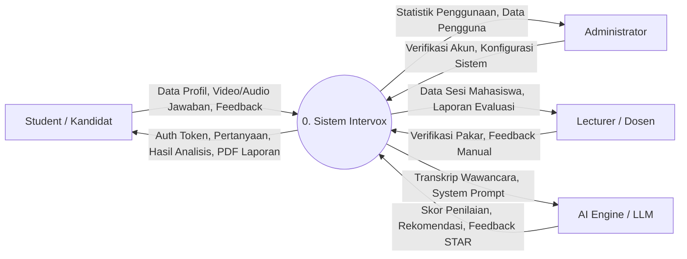

**Gambar 3.3** DFD Level 0 — Context Diagram Sistem Intervox

---

### 3.2.2 DFD Level 1

Level 1 memecah Sistem Intervox menjadi proses-proses utama (sub-sistem) dan bagaimana data mengalir ke basis data (_data stores_).

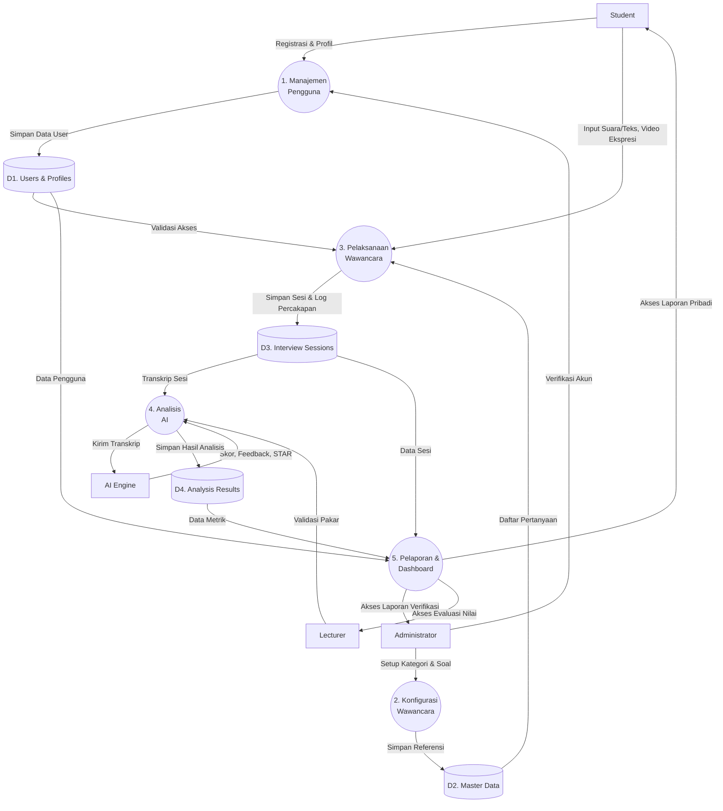

**Gambar 3.4** DFD Level 1 — Proses Utama Sistem Intervox

---

### 3.2.3 DFD Level 2 (Breakdown Proses 3: Pelaksanaan Wawancara)

Level ini membedah lebih detail apa yang terjadi saat kandidat melakukan simulasi wawancara.

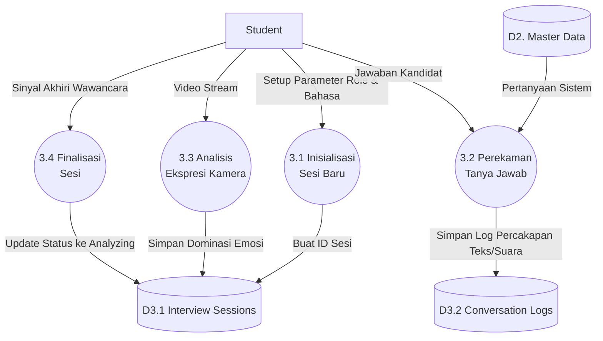

**Gambar 3.5** DFD Level 2 — Breakdown Proses Pelaksanaan Wawancara

---

### 3.2.4 DFD Level 3 (Breakdown Proses 4: Analisis AI)

Level ini menjabarkan bagaimana sistem meracik _prompt_, memanggil API LLM (Gemini), dan menyimpan respons terstruktur.

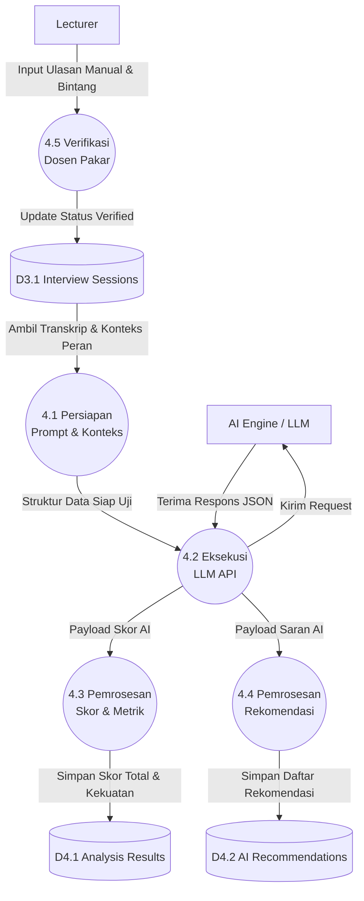

**Gambar 3.6** DFD Level 3 — Breakdown Proses Analisis AI

---

### 3.2.5 DFD Level 4 (Breakdown Proses 4.3: Pemrosesan Skor & Metrik)

Level 4 adalah tingkatan yang paling granular (spesifik), menunjukkan bagaimana JSON dari AI dibongkar (_parsing_) menjadi metrik-metrik individu sebelum disimpan.

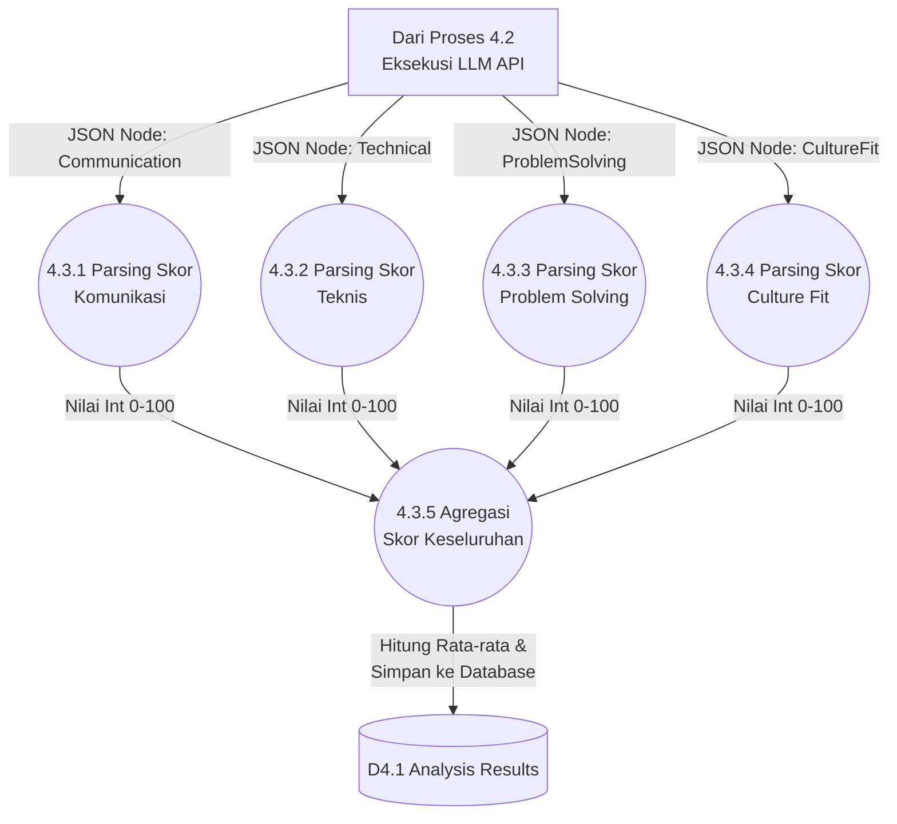

**Gambar 3.7** DFD Level 4 — Breakdown Pemrosesan Skor & Me## 3.3 Activity Diagram

Activity diagram merupakan diagram alir yang memodelkan tahapan proses atau alur kerja (*workflow*) dari setiap fungsi yang ada di dalam sistem. Pada pemodelan sistem Intervox ini, activity diagram disusun **per fungsi per role** secara komprehensif dan lengkap untuk seluruh aktivitas yang memerlukan input data dari pengguna (*input-driven processes*), meliputi 4 (empat) peran utama aplikasi yaitu: **Mahasiswa (*Student*)**, **Dosen Pembimbing (*Lecturer*)**, **Dekan / Pimpinan Fakultas (*Dean*)**, dan **Administrator (*Admin*)**.

---

### 3.3.1 Activity Diagram — Student

#### 1. Activity Diagram Registrasi Akun (Student)
Activity diagram ini menggambarkan proses pendaftaran akun baru oleh mahasiswa dengan melengkapi informasi pribadi dan akademik, hingga menunggu persetujuan (*approval*) dari Administrator.

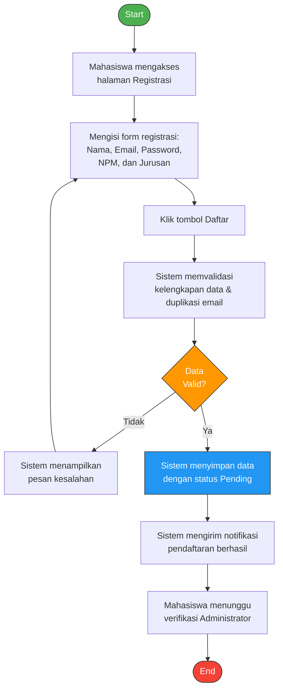

**Gambar 3.8** Activity Diagram Registrasi Akun (Student)

---

#### 2. Activity Diagram Login (Student)
Activity diagram login menunjukkan alur autentikasi mahasiswa saat memasuki sistem Intervox, termasuk pengecekan kredensial akun dan status verifikasi akun.

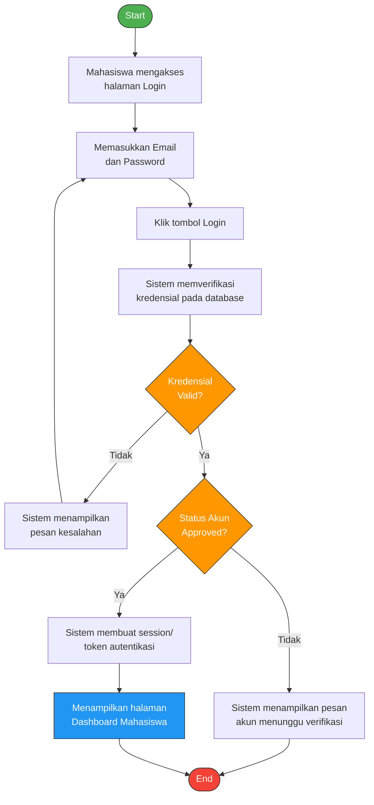

**Gambar 3.9** Activity Diagram Login (Student)

---

#### 3. Activity Diagram Lupa Password / Reset Password (Student)
Activity diagram ini menggambarkan tahapan mahasiswa ketika lupa kata sandi akun, di mana sistem akan mengirimkan tautan pemulihan (*reset password link*) ke email terdaftar.

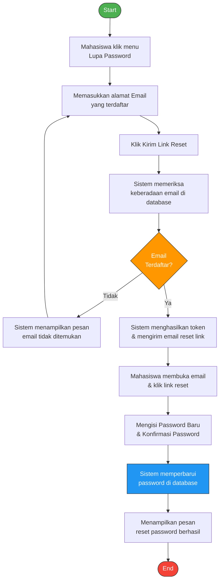

**Gambar 3.10** Activity Diagram Lupa Password / Reset Password (Student)

---

#### 4. Activity Diagram Kelola Profil Akademik (Student)
Activity diagram ini menggambarkan proses mahasiswa dalam melengkapi dan memperbarui data akademik serta mengunggah dokumen *Curriculum Vitae* (CV) yang digunakan sebagai konteks analisis AI.

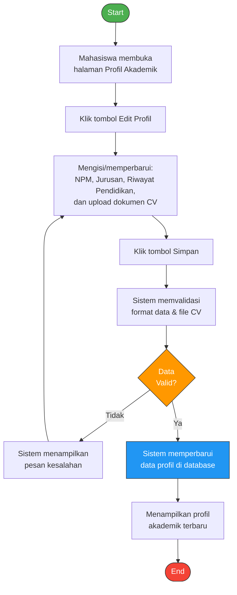

**Gambar 3.11** Activity Diagram Kelola Profil Akademik (Student)

---

#### 5. Activity Diagram Membuat Simulasi Wawancara (Student)
Activity diagram ini adalah inti dari aktivitas mahasiswa di platform Intervox, mulai dari konfigurasi simulasi wawancara, interaksi *voice-to-voice* bersama AI, rekaman ekspresi wajah via webcam, pengisian *self-assessment*, hingga pemrosesan skor evaluasi.

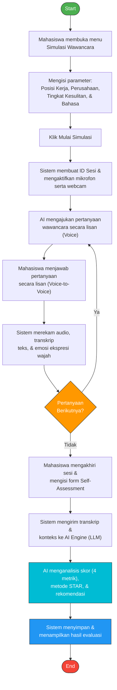

**Gambar 3.12** Activity Diagram Membuat Simulasi Wawancara (Student)

---

#### 6. Activity Diagram Mengisi Self-Assessment & Refleksi Mandiri (Student)
Activity diagram ini menggambarkan proses pengisian evaluasi diri (*Self-Assessment*) setelah simulasi wawancara selesai, untuk membandingkan persepsi kesiapan kandidat dengan hasil analisis AI.

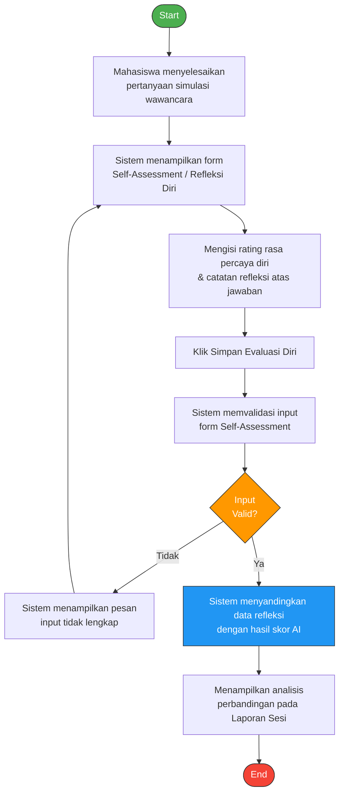

**Gambar 3.13** Activity Diagram Mengisi Self-Assessment & Refleksi Mandiri (Student)

---

#### 7. Activity Diagram Mengelola Riwayat Sesi Wawancara (Student)
Activity diagram ini memodelkan bagaimana mahasiswa dapat meninjau riwayat latihan simulasi wawancara serta menghapus arsip sesi latihan yang sudah lama atau tidak ingin disimpan di portofolio.

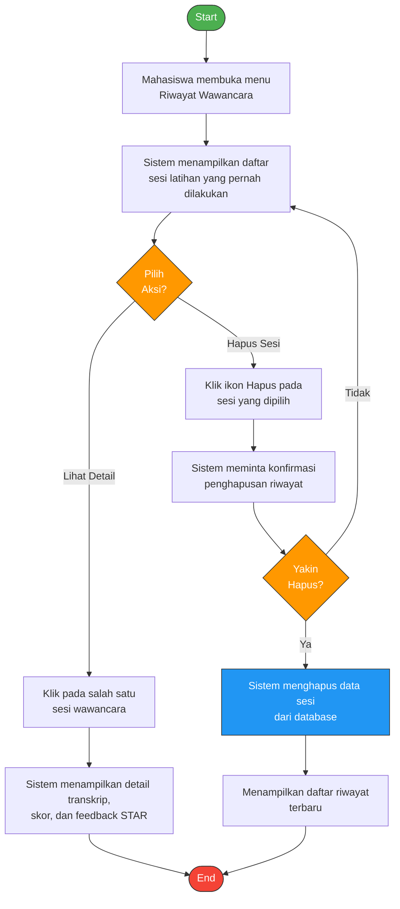

**Gambar 3.14** Activity Diagram Mengelola Riwayat Sesi Wawancara (Student)

---

#### 8. Activity Diagram Mengirim Kritik dan Saran (Student)
Activity diagram ini memodelkan alur partisipasi mahasiswa dalam memberikan masukan (*user feedback*), kritik, ataupun pelaporan kendala teknis pada platform Intervox.

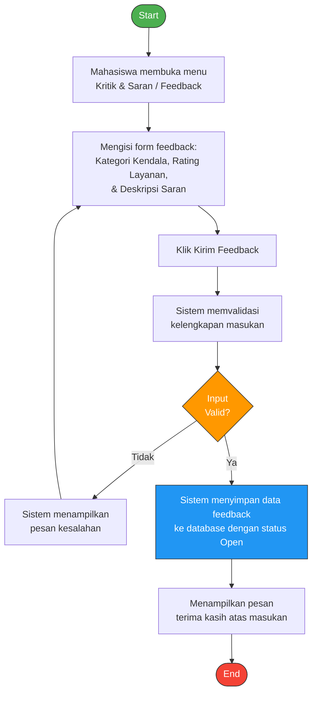

**Gambar 3.15** Activity Diagram Mengirim Kritik dan Saran (Student)

---

### 3.3.2 Activity Diagram — Lecturer

#### 9. Activity Diagram Login (Lecturer)
Activity diagram login menunjukkan proses autentikasi Dosen Pembimbing untuk mengakses fitur monitoring, validasi, dan kelola bank soal.

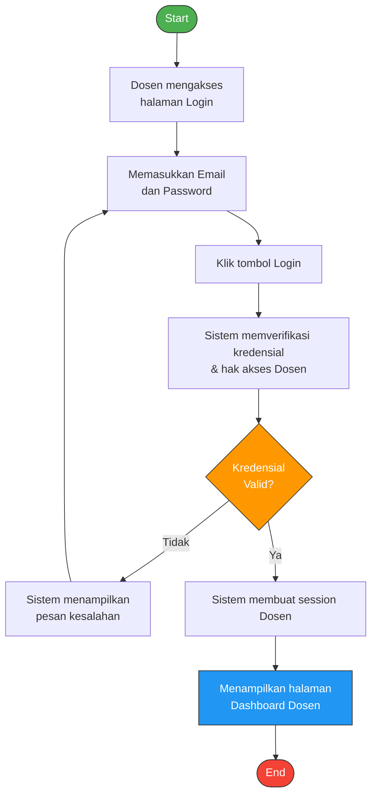

**Gambar 3.16** Activity Diagram Login (Lecturer)

---

#### 10. Activity Diagram Lupa Password / Reset Password (Lecturer)
Activity diagram ini menggambarkan proses pemulihan kata sandi bagi Dosen Pembimbing jika mengalami kendala akses akun.

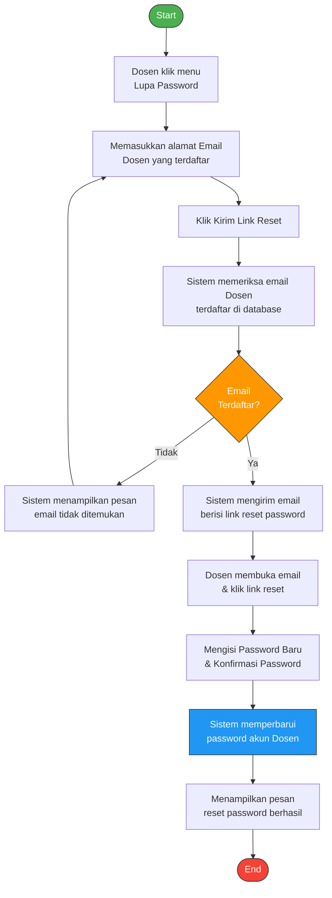

**Gambar 3.17** Activity Diagram Lupa Password / Reset Password (Lecturer)

---

#### 11. Activity Diagram Kelola Profil (Lecturer)
Activity diagram ini menggambarkan alur Dosen Pembimbing dalam memperbarui data diri yang terhubung dengan mahasiswa bimbingan.

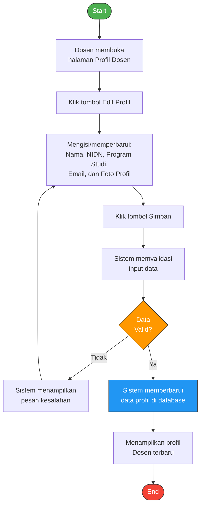

**Gambar 3.18** Activity Diagram Kelola Profil (Lecturer)

---

#### 12. Activity Diagram Kelola Bank Soal (Lecturer)
Activity diagram ini menjelaskan alur kerja Dosen Pembimbing dalam menambah, mengubah, dan menghapus pertanyaan pada bank soal (*Question Banks*) per kategori modul wawancara.

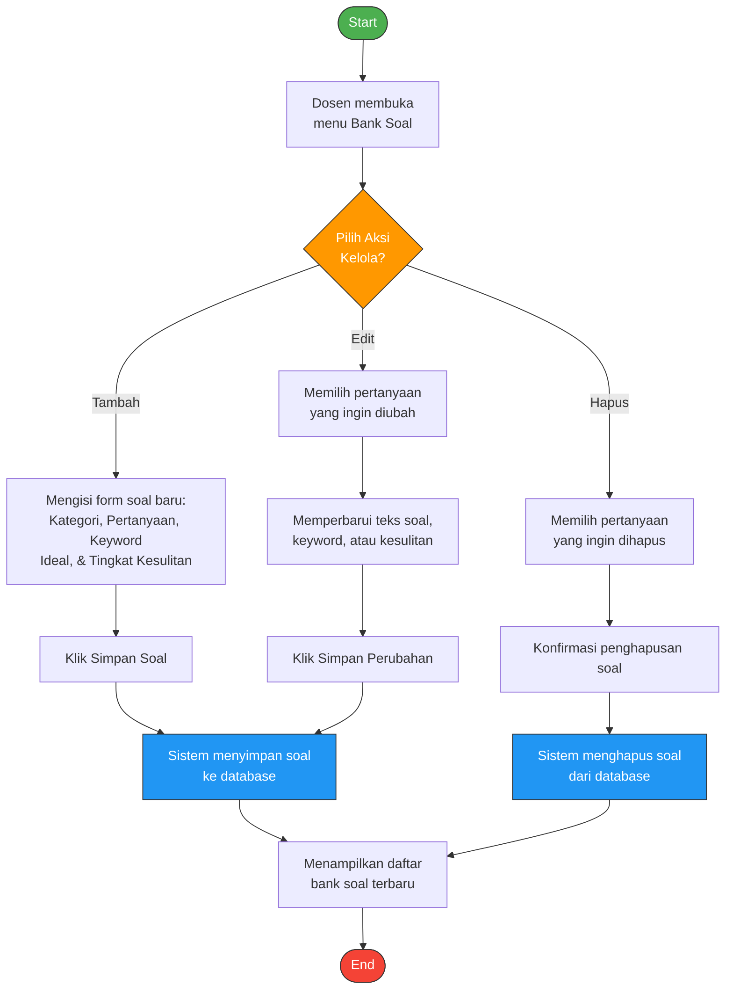

**Gambar 3.19** Activity Diagram Kelola Bank Soal (Lecturer)

---

#### 13. Activity Diagram Validasi & Feedback Manual Hasil Evaluasi AI (Lecturer)
Activity diagram ini menggambarkan peran Dosen Pembimbing dalam memvalidasi hasil penilaian otomatis AI, memberikan komentar naratif, serta memberikan rating bintang kepada sesi latihan mahasiswa.

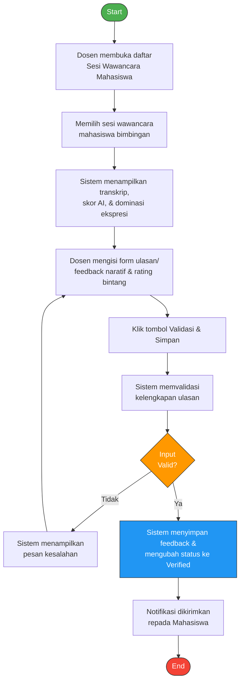

**Gambar 3.20** Activity Diagram Validasi & Feedback Manual Hasil Evaluasi AI (Lecturer)

---

#### 14. Activity Diagram Kelola Catatan Mentoring & Bimbingan (Lecturer)
Activity diagram ini menunjukkan proses Dosen Pembimbing dalam mencatat hasil bimbingan karir dan mentoring langsung kepada mahasiswa yang dibimbingnya.

```mermaid
flowchart TD
    Start([Start]) --> A["Dosen membuka menu\nCatatan Bimbingan / Mentoring"]
    A --> B{"Pilih Aksi\nCatatan?"}
    B -->|Tambah Catatan| C["Memilih mahasiswa &\nmengisi topik/catatan bimbingan"]
    C --> D["Klik Simpan Catatan"]
    D --> E["Sistem menyimpan catatan\nke database"]
    B -->|Edit Catatan| F["Memilih catatan yang ada &\nmemperbarui isi masukan"]
    F --> G["Klik Simpan Perubahan"]
    G --> E
    E --> H["Notifikasi masukan\ndikirim ke Mahasiswa"]
    H --> End([End])

    style Start fill:#4CAF50,stroke:#333,color:#fff
    style End fill:#f44336,stroke:#333,color:#fff
    style B fill:#FF9800,stroke:#333,color:#fff
    style E fill:#2196F3,stroke:#333,color:#fff
```

**Gambar 3.21** Activity Diagram Kelola Catatan Mentoring & Bimbingan (Lecturer)

---

#### 15. Activity Diagram Memberikan Penugasan Modul Latihan (Lecturer)
Activity diagram ini menggambarkan bagaimana Dosen Pembimbing menugaskan paket modul wawancara tertentu kepada mahasiswa sebagai bagian dari tugas mata kuliah atau persiapan magang/kerja.

```mermaid
flowchart TD
    Start([Start]) --> A["Dosen membuka menu\nPenugasan Latihan"]
    A --> B["Memilih kategori modul wawancara\n& tenggat waktu (Deadline)"]
    B --> C["Memilih daftar mahasiswa/\nkelas bimbingan yang ditugaskan"]
    C --> D["Klik tombol Kirim Penugasan"]
    D --> E["Sistem memvalidasi\nparameter penugasan"]
    E --> F{"Input\nValid?"}
    F -->|Tidak| G["Sistem menampilkan pesan\nparameter belum lengkap"]
    G --> B
    F -->|Ya| H["Sistem menyimpan data penugasan\nke database"]
    H --> I["Sistem mengirim notifikasi\ntugas ke akun Mahasiswa"]
    I --> End([End])

    style Start fill:#4CAF50,stroke:#333,color:#fff
    style End fill:#f44336,stroke:#333,color:#fff
    style F fill:#FF9800,stroke:#333,color:#fff
    style H fill:#2196F3,stroke:#333,color:#fff
```

**Gambar 3.22** Activity Diagram Memberikan Penugasan Modul Latihan (Lecturer)

---

### 3.3.3 Activity Diagram — Dean

#### 16. Activity Diagram Login (Dean)
Activity diagram ini menunjukkan alur login bagi Dekan atau Pimpinan Fakultas yang mengakses dasbor statistik dan pengawasan mutu akademik.

```mermaid
flowchart TD
    Start([Start]) --> A["Dekan mengakses\nhalaman Login"]
    A --> B["Memasukkan Email\ndan Password"]
    B --> C["Klik tombol Login"]
    C --> D["Sistem memverifikasi kredensial\n& hak akses Dekan"]
    D --> E{"Kredensial\nValid?"}
    E -->|Tidak| F["Sistem menampilkan\npesan kesalahan"]
    F --> B
    E -->|Ya| G["Sistem membuat session Dekan"]
    G --> H["Menampilkan halaman\nDashboard Pimpinan/Dekan"]
    H --> End([End])

    style Start fill:#4CAF50,stroke:#333,color:#fff
    style End fill:#f44336,stroke:#333,color:#fff
    style E fill:#FF9800,stroke:#333,color:#fff
    style H fill:#2196F3,stroke:#333,color:#fff
```

**Gambar 3.23** Activity Diagram Login (Dean)

---

#### 17. Activity Diagram Lupa Password / Reset Password (Dean)
Activity diagram ini memodelkan proses pemulihan kata sandi bagi pimpinan fakultas jika lupa atau ingin memperbarui kata sandi secara aman.

```mermaid
flowchart TD
    Start([Start]) --> A["Dekan klik menu\nLupa Password"]
    A --> B["Memasukkan alamat Email\npimpinan yang terdaftar"]
    B --> C["Klik Kirim Link Reset"]
    C --> D["Sistem memeriksa keberadaan\nemail di database"]
    D --> E{"Email\nTerdaftar?"}
    E -->|Tidak| F["Sistem menampilkan pesan\nemail tidak ditemukan"]
    F --> B
    E -->|Ya| G["Sistem mengirim email\nberisi link reset password"]
    G --> H["Dekan membuka email\n& klik link reset"]
    H --> I["Mengisi Password Baru\n& Konfirmasi Password"]
    I --> J["Sistem memperbarui\npassword akun Dekan"]
    J --> K["Menampilkan pesan\nreset password berhasil"]
    K --> End([End])

    style Start fill:#4CAF50,stroke:#333,color:#fff
    style End fill:#f44336,stroke:#333,color:#fff
    style E fill:#FF9800,stroke:#333,color:#fff
    style J fill:#2196F3,stroke:#333,color:#fff
```

**Gambar 3.24** Activity Diagram Lupa Password / Reset Password (Dean)

---

#### 18. Activity Diagram Kelola Profil (Dean)
Activity diagram ini menggambarkan bagaimana Dekan atau Pimpinan Fakultas dapat memperbarui informasi profil akun pimpinan.

```mermaid
flowchart TD
    Start([Start]) --> A["Dekan membuka\nhalaman Profil Pimpinan"]
    A --> B["Klik tombol Edit Profil"]
    B --> C["Mengisi/memperbarui:\nNama, NIP/NIDN, Fakultas,\nEmail, dan Foto Profil"]
    C --> D["Klik tombol Simpan"]
    D --> E["Sistem memvalidasi\ninput data profil"]
    E --> F{"Data\nValid?"}
    F -->|Tidak| G["Sistem menampilkan\npesan kesalahan"]
    G --> C
    F -->|Ya| H["Sistem memperbarui\ndata profil di database"]
    H --> I["Menampilkan profil\nDekan terbaru"]
    I --> End([End])

    style Start fill:#4CAF50,stroke:#333,color:#fff
    style End fill:#f44336,stroke:#333,color:#fff
    style F fill:#FF9800,stroke:#333,color:#fff
    style H fill:#2196F3,stroke:#333,color:#fff
```

**Gambar 3.25** Activity Diagram Kelola Profil (Dean)

---

#### 19. Activity Diagram Memberikan Catatan / Disposisi Evaluasi Fakultas (Dean)
Activity diagram ini menggambarkan wewenang pimpinan fakultas dalam memberikan disposisi, catatan evaluasi eksekutif, atau rekomendasi kebijakan atas laporan statistik kompetensi kesiapan wawancara mahasiswa.

```mermaid
flowchart TD
    Start([Start]) --> A["Dekan membuka Dashboard\nStatistik & Laporan Fakultas"]
    A --> B["Memilih periode evaluasi\n& program studi target"]
    B --> C["Sistem menampilkan laporan\nagregat performa wawancara"]
    C --> D["Dekan mengisi form Catatan/\nDisposisi Pimpinan Fakultas"]
    D --> E["Klik tombol Simpan Disposisi"]
    E --> F["Sistem memvalidasi\nisi catatan evaluasi"]
    F --> G{"Input\nValid?"}
    G -->|Tidak| H["Sistem menampilkan pesan\ninput tidak lengkap"]
    H --> D
    G -->|Ya| I["Sistem menyimpan disposisi\nke database resmi fakultas"]
    I --> J["Notifikasi dikirimkan kepada\nProdi & Dosen Pembimbing"]
    J --> End([End])

    style Start fill:#4CAF50,stroke:#333,color:#fff
    style End fill:#f44336,stroke:#333,color:#fff
    style G fill:#FF9800,stroke:#333,color:#fff
    style I fill:#2196F3,stroke:#333,color:#fff
```

**Gambar 3.26** Activity Diagram Memberikan Catatan / Disposisi Evaluasi Fakultas (Dean)

---

### 3.3.4 Activity Diagram — Administrator

#### 20. Activity Diagram Login (Administrator)
Activity diagram ini menunjukkan alur login bagi Administrator yang memiliki hak akses penuh dalam mengelola sistem.

```mermaid
flowchart TD
    Start([Start]) --> A["Admin mengakses\nhalaman Login"]
    A --> B["Memasukkan Email\ndan Password"]
    B --> C["Klik tombol Login"]
    C --> D["Sistem memverifikasi\nkredensial Admin"]
    D --> E{"Kredensial\nValid?"}
    E -->|Tidak| F["Sistem menampilkan\npesan kesalahan"]
    F --> B
    E -->|Ya| G["Sistem membuat session Admin"]
    G --> H["Menampilkan halaman\nDashboard Admin"]
    H --> End([End])

    style Start fill:#4CAF50,stroke:#333,color:#fff
    style End fill:#f44336,stroke:#333,color:#fff
    style E fill:#FF9800,stroke:#333,color:#fff
    style H fill:#2196F3,stroke:#333,color:#fff
```

**Gambar 3.27** Activity Diagram Login (Administrator)

---

#### 21. Activity Diagram Lupa Password / Reset Password (Administrator)
Activity diagram ini menggambarkan proses pemulihan akun Administrator jika terjadi kendala login, dengan protokol keamanan reset password via email.

```mermaid
flowchart TD
    Start([Start]) --> A["Admin klik menu\nLupa Password"]
    A --> B["Memasukkan alamat Email\nAdmin yang terdaftar"]
    B --> C["Klik Kirim Link Reset"]
    C --> D["Sistem memeriksa email Admin\ndi database"]
    D --> E{"Email\nTerdaftar?"}
    E -->|Tidak| F["Sistem menampilkan pesan\nemail tidak ditemukan"]
    F --> B
    E -->|Ya| G["Sistem mengirim email\nberisi link reset password"]
    G --> H["Admin membuka email\n& klik link reset"]
    H --> I["Mengisi Password Baru\n& Konfirmasi Password"]
    I --> J["Sistem memperbarui\npassword akun Admin"]
    J --> K["Menampilkan pesan\nreset password berhasil"]
    K --> End([End])

    style Start fill:#4CAF50,stroke:#333,color:#fff
    style End fill:#f44336,stroke:#333,color:#fff
    style E fill:#FF9800,stroke:#333,color:#fff
    style J fill:#2196F3,stroke:#333,color:#fff
```

**Gambar 3.28** Activity Diagram Lupa Password / Reset Password (Administrator)

---

#### 22. Activity Diagram Kelola Profil (Administrator)
Activity diagram ini menunjukkan proses pengelolaan profil dan kredensial keamanan oleh Administrator.

```mermaid
flowchart TD
    Start([Start]) --> A["Admin membuka\nhalaman Profil Admin"]
    A --> B["Klik tombol Edit Profil"]
    B --> C["Mengisi/memperbarui:\nNama, Email, Password, & Foto"]
    C --> D["Klik tombol Simpan"]
    D --> E["Sistem memvalidasi\nformat input & keamanan"]
    E --> F{"Data\nValid?"}
    F -->|Tidak| G["Sistem menampilkan\npesan kesalahan"]
    G --> C
    F -->|Ya| H["Sistem memperbarui\nprofil Admin di database"]
    H --> I["Menampilkan profil\nAdmin terbaru"]
    I --> End([End])

    style Start fill:#4CAF50,stroke:#333,color:#fff
    style End fill:#f44336,stroke:#333,color:#fff
    style F fill:#FF9800,stroke:#333,color:#fff
    style H fill:#2196F3,stroke:#333,color:#fff
```

**Gambar 3.29** Activity Diagram Kelola Profil (Administrator)

---

#### 23. Activity Diagram Verifikasi Akun Pengguna (Administrator)
Activity diagram ini menggambarkan alur kerja Administrator dalam memverifikasi dan menyetujui akun pendaftaran mahasiswa baru.

```mermaid
flowchart TD
    Start([Start]) --> A["Admin membuka halaman\nVerifikasi Akun Pengguna"]
    A --> B["Sistem menampilkan daftar\nakun berstatus Pending"]
    B --> C["Admin memeriksa detail profil\n& data akademik pendaftar"]
    C --> D{"Keputusan\nVerifikasi?"}
    D -->|Setujui| E["Klik tombol Approve"]
    E --> F["Sistem mengubah status\nakun menjadi Approved"]
    F --> G["Sistem mengirim email/\nnotifikasi persetujuan"]
    D -->|Tolak| H["Klik tombol Reject &\nisi alasan penolakan"]
    H --> I["Sistem mengubah status\nakun menjadi Rejected"]
    I --> J["Sistem mengirim email/\nnotifikasi penolakan"]
    G --> End([End])
    J --> End

    style Start fill:#4CAF50,stroke:#333,color:#fff
    style End fill:#f44336,stroke:#333,color:#fff
    style D fill:#FF9800,stroke:#333,color:#fff
    style F fill:#2196F3,stroke:#333,color:#fff
```

**Gambar 3.30** Activity Diagram Verifikasi Akun Pengguna (Administrator)

---

#### 24. Activity Diagram Kelola Kategori Modul Wawancara (Administrator)
Activity diagram ini memodelkan proses pengelolaan master data kategori modul wawancara yang menjadi dasar pengelompokan bank soal di sistem.

```mermaid
flowchart TD
    Start([Start]) --> A["Admin membuka halaman\nManajemen Kategori Modul"]
    A --> B{"Pilih Aksi\nKelola?"}

    B -->|Tambah| C["Mengisi form kategori:\nNama Kategori, Deskripsi,\nTipe, & Tingkat Kesulitan"]
    C --> D["Klik Simpan Kategori"]
    D --> E["Sistem menyimpan kategori\nke database"]

    B -->|Edit| F["Memilih kategori\nyang ingin diubah"]
    F --> G["Memperbarui informasi\n& parameter kategori"]
    G --> H["Klik Simpan Perubahan"]
    H --> E

    B -->|Nonaktifkan| I["Memilih kategori\nyang ingin dinonaktifkan"]
    I --> J["Konfirmasi perubahan status"]
    J --> K["Sistem mengubah status\nkategori menjadi Nonaktif"]

    E --> L["Menampilkan daftar\nkategori modul terbaru"]
    K --> L
    L --> End([End])

    style Start fill:#4CAF50,stroke:#333,color:#fff
    style End fill:#f44336,stroke:#333,color:#fff
    style B fill:#FF9800,stroke:#333,color:#fff
    style E fill:#2196F3,stroke:#333,color:#fff
    style K fill:#2196F3,stroke:#333,color:#fff
```

**Gambar 3.31** Activity Diagram Kelola Kategori Modul Wawancara (Administrator)

---

#### 25. Activity Diagram Kelola Kriteria Penilaian (Administrator)
Activity diagram ini menggambarkan bagaimana Administrator mengatur kriteria penilaian (*Scoring Criteria*), bobot masing-masing metrik, dan parameter kunci yang dijadikan rujukan oleh AI Engine.

```mermaid
flowchart TD
    Start([Start]) --> A["Admin membuka halaman\nKriteria Penilaian"]
    A --> B{"Pilih Aksi\nKelola?"}

    B -->|Tambah| C["Mengisi form kriteria baru:\nNama Metrik, Bobot Nilai,\n& Keyword Penilaian"]
    C --> D["Klik Simpan Kriteria"]
    D --> E["Sistem menyimpan kriteria\nke database"]

    B -->|Edit| F["Memilih kriteria penilaian\nyang ingin diatur ulang"]
    F --> G["Memperbarui bobot nilai\natau parameter keyword"]
    G --> H["Klik Simpan Perubahan"]
    H --> E

    B -->|Hapus| I["Memilih kriteria\nyang ingin dihapus"]
    I --> J["Konfirmasi penghapusan"]
    J --> K["Sistem menghapus kriteria\ndari database"]

    E --> L["Menampilkan konfigurasi\nkriteria penilaian terbaru"]
    K --> L
    L --> End([End])

    style Start fill:#4CAF50,stroke:#333,color:#fff
    style End fill:#f44336,stroke:#333,color:#fff
    style B fill:#FF9800,stroke:#333,color:#fff
    style E fill:#2196F3,stroke:#333,color:#fff
    style K fill:#2196F3,stroke:#333,color:#fff
```

**Gambar 3.32** Activity Diagram Kelola Kriteria Penilaian (Administrator)

---

#### 26. Activity Diagram Kelola Bank Soal (Administrator)
Selain Dosen Pembimbing, Administrator juga memiliki wewenang untuk mengelola bank soal secara menyeluruh lintas fakultas dan program studi.

```mermaid
flowchart TD
    Start([Start]) --> A["Admin membuka\nhalaman Bank Soal"]
    A --> B{"Pilih Aksi\nKelola?"}

    B -->|Tambah| C["Mengisi form pertanyaan baru:\nKategori, Pertanyaan, Keyword,\n& Tingkat Kesulitan"]
    C --> D["Klik Simpan Soal"]
    D --> E["Sistem menyimpan soal\nke database"]

    B -->|Edit| F["Memilih pertanyaan\nyang ingin diperbarui"]
    F --> G["Mengubah isi soal,\nkeyword, atau kesulitan"]
    G --> H["Klik Simpan Perubahan"]
    H --> E

    B -->|Hapus| I["Memilih pertanyaan\nyang ingin dihapus"]
    I --> J["Konfirmasi penghapusan soal"]
    J --> K["Sistem menghapus soal\ndari database"]

    E --> L["Menampilkan daftar\nbank soal terbaru"]
    K --> L
    L --> End([End])

    style Start fill:#4CAF50,stroke:#333,color:#fff
    style End fill:#f44336,stroke:#333,color:#fff
    style B fill:#FF9800,stroke:#333,color:#fff
    style E fill:#2196F3,stroke:#333,color:#fff
    style K fill:#2196F3,stroke:#333,color:#fff
```

**Gambar 3.33** Activity Diagram Kelola Bank Soal (Administrator)

---

#### 27. Activity Diagram Kelola Data Dosen & Pengguna (Administrator)
Activity diagram ini menggambarkan pengelolaan akun pengguna sistem, khususnya penambahan dan pemutakhiran data Dosen Pembimbing oleh Administrator.

```mermaid
flowchart TD
    Start([Start]) --> A["Admin membuka halaman\nManajemen Pengguna & Dosen"]
    A --> B{"Pilih Aksi\nKelola?"}

    B -->|Tambah| C["Mengisi form data Dosen/User:\nNama, NIDN/NPM, Email,\nPassword, & Role"]
    C --> D["Klik Simpan Pengguna"]
    D --> E["Sistem menyimpan akun baru\nke database"]

    B -->|Edit| F["Memilih akun pengguna\nyang ingin diubah"]
    F --> G["Memperbarui informasi\natau hak akses role"]
    G --> H["Klik Simpan Perubahan"]
    H --> E

    B -->|Nonaktifkan| I["Memilih akun pengguna\nyang ingin dinonaktifkan"]
    I --> J["Konfirmasi nonaktif akun"]
    J --> K["Sistem mengubah status\nakun menjadi Nonaktif"]

    E --> L["Menampilkan daftar\npengguna sistem terbaru"]
    K --> L
    L --> End([End])

    style Start fill:#4CAF50,stroke:#333,color:#fff
    style End fill:#f44336,stroke:#333,color:#fff
    style B fill:#FF9800,stroke:#333,color:#fff
    style E fill:#2196F3,stroke:#333,color:#fff
    style K fill:#2196F3,stroke:#333,color:#fff
```

**Gambar 3.34** Activity Diagram Kelola Data Dosen & Pengguna (Administrator)

---

#### 28. Activity Diagram Kelola Master Data Fakultas & Program Studi (Administrator)
Activity diagram ini menggambarkan proses Administrator dalam mengelola master data Fakultas dan Program Studi di lingkungan universitas.

```mermaid
flowchart TD
    Start([Start]) --> A["Admin membuka halaman\nMaster Data Fakultas & Prodi"]
    A --> B{"Pilih Aksi\nKelola?"}

    B -->|Tambah| C["Mengisi form data baru:\nNama Fakultas/Prodi, Kode,\n& Jenjang Pendidikan"]
    C --> D["Klik Simpan Data"]
    D --> E["Sistem menyimpan data\nke database"]

    B -->|Edit| F["Memilih Fakultas/Prodi\nyang ingin diubah"]
    F --> G["Memperbarui nama,\nkode, atau status aktif"]
    G --> H["Klik Simpan Perubahan"]
    H --> E

    B -->|Hapus| I["Memilih Fakultas/Prodi\nyang ingin dihapus"]
    I --> J["Konfirmasi penghapusan"]
    J --> K["Sistem menghapus data\ndari database"]

    E --> L["Menampilkan struktur\nFakultas & Prodi terbaru"]
    K --> L
    L --> End([End])

    style Start fill:#4CAF50,stroke:#333,color:#fff
    style End fill:#f44336,stroke:#333,color:#fff
    style B fill:#FF9800,stroke:#333,color:#fff
    style E fill:#2196F3,stroke:#333,color:#fff
    style K fill:#2196F3,stroke:#333,color:#fff
```

**Gambar 3.35** Activity Diagram Kelola Master Data Fakultas & Program Studi (Administrator)

---

#### 29. Activity Diagram Kelola Konfigurasi & Parameter AI Engine (Administrator)
Activity diagram ini menunjukkan proses Administrator dalam mengatur konfigurasi *System Prompt* LLM (Gemini), parameter sensitivitas analisis suara, serta batas waktu sesi wawancara.

```mermaid
flowchart TD
    Start([Start]) --> A["Admin membuka halaman\nKonfigurasi AI Engine"]
    A --> B["Memilih parameter yang diatur:\nSystem Prompt, AI Model,\natau Audio Threshold"]
    B --> C["Mengubah instruksi prompt\natau nilai parameter AI"]
    C --> D["Klik tombol Simpan Konfigurasi"]
    D --> E["Sistem memvalidasi koneksi\n& sintaks parameter API"]
    E --> F{"Parameter\nValid?"}
    F -->|Tidak| G["Sistem menampilkan pesan\nkesalahan konfigurasi"]
    G --> B
    F -->|Ya| H["Sistem memperbarui parameter\ndi database konfigurasi"]
    H --> I["AI Engine menggunakan\nkonfigurasi terbaru pada sesi baru"]
    I --> End([End])

    style Start fill:#4CAF50,stroke:#333,color:#fff
    style End fill:#f44336,stroke:#333,color:#fff
    style F fill:#FF9800,stroke:#333,color:#fff
    style H fill:#2196F3,stroke:#333,color:#fff
```

**Gambar 3.36** Activity Diagram Kelola Konfigurasi & Parameter AI Engine (Administrator)

---

#### 30. Activity Diagram Kelola & Merespons Feedback Pengguna (Administrator)
Activity diagram ini menggambarkan bagaimana Administrator meninjau dan menindaklanjuti masukan, kritik, maupun laporan kendala teknis dari mahasiswa dan dosen.

```mermaid
flowchart TD
    Start([Start]) --> A["Admin membuka halaman\nManajemen Feedback Pengguna"]
    A --> B["Sistem menampilkan daftar\nkritik, saran, & laporan masalah"]
    B --> C["Memilih salah satu feedback\nuntuk ditindaklanjuti"]
    C --> D["Mengisi tanggapan/\nsaran penyelesaian masalah"]
    D --> E["Klik Kirim Balasan &\nUbah Status ke Closed"]
    E --> F["Sistem memperbarui status\nfeedback di database"]
    F --> G["Sistem mengirim notifikasi/\nemail balasan ke Pengguna"]
    G --> End([End])

    style Start fill:#4CAF50,stroke:#333,color:#fff
    style End fill:#f44336,stroke:#333,color:#fff
    style F fill:#2196F3,stroke:#333,color:#fff
```

**Gambar 3.37** Activity Diagram Kelola & Merespons Feedback Pengguna (Administrator)
