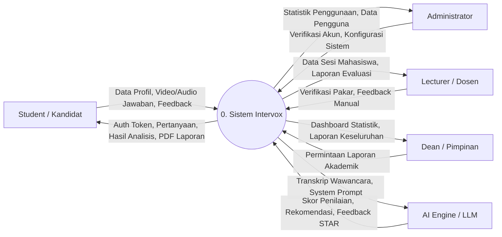
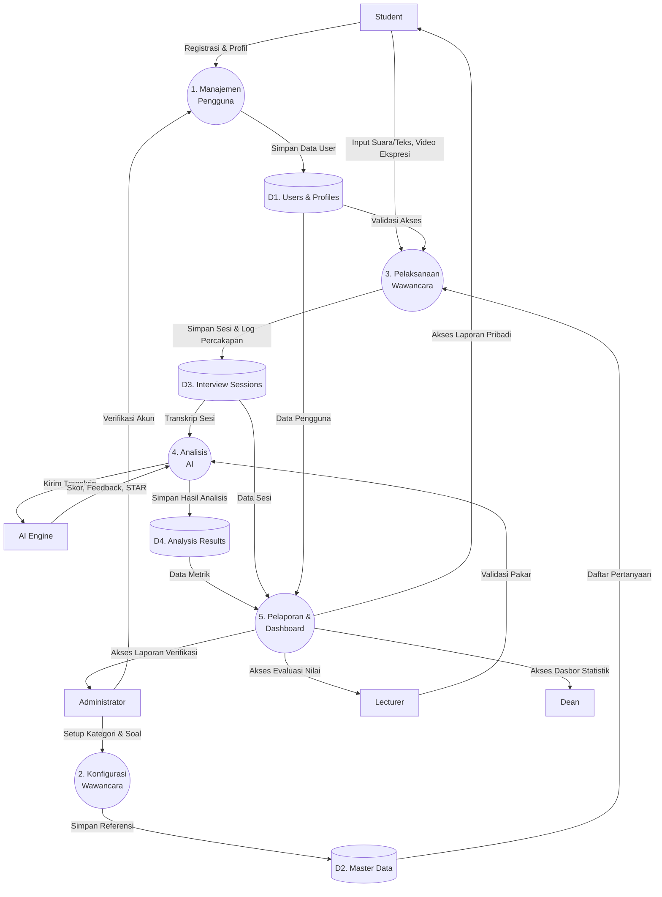
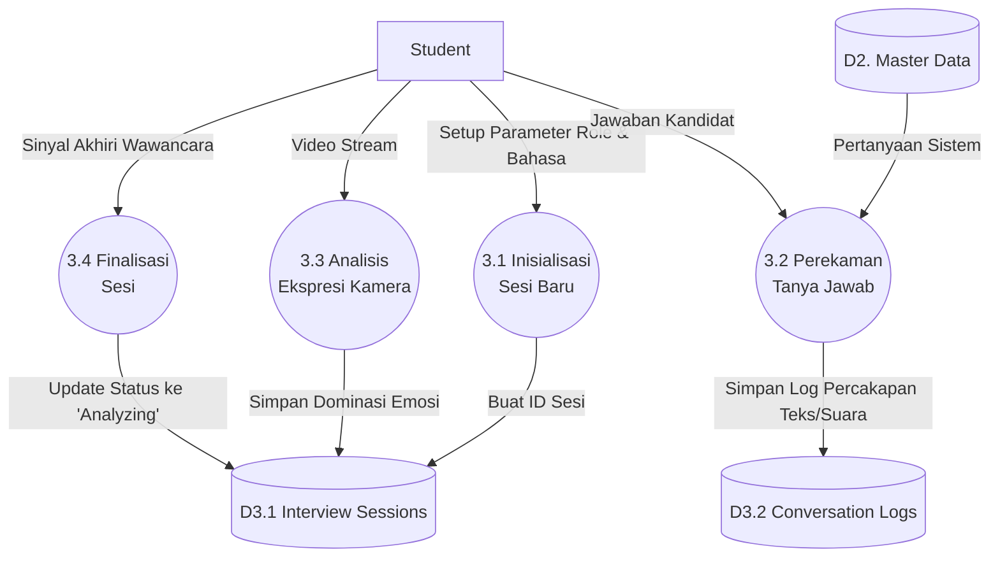
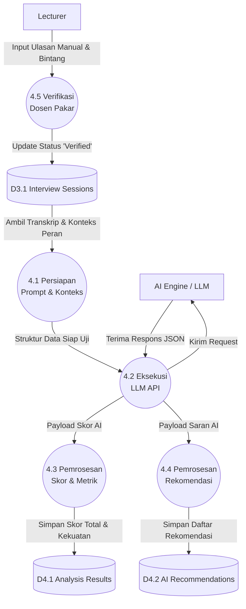

# Data Flow Diagram (DFD) Aplikasi Intervox

Dokumen ini berisi pemodelan **Data Flow Diagram (DFD)** mulai dari Level 0 (Context Diagram) hingga Level 4 untuk aplikasi **Intervox** (AI Interview System).

> [!NOTE]
> Pemodelan ini disusun berdasarkan struktur *database* Supabase dan arsitektur fitur aplikasi saat ini (termasuk peran Student, Administrator, Lecturer, dan Dean).

---

## 1. DFD Level 0 (Context Diagram)
Diagram konteks menggambarkan interaksi sistem secara keseluruhan dengan entitas eksternal (Terminators).



---

## 2. DFD Level 1
Level 1 memecah Sistem Intervox menjadi proses-proses utama (sub-sistem) dan bagaimana data mengalir ke basis data (*data stores*).



---

## 3. DFD Level 2 (Breakdown Proses 3: Pelaksanaan Wawancara)
Level ini membedah lebih detail apa yang terjadi saat kandidat melakukan simulasi wawancara.



---

## 4. DFD Level 3 (Breakdown Proses 4: Analisis AI)
Level ini menjabarkan bagaimana sistem meracik *prompt*, memanggil API LLM (Gemini), dan menyimpan respons struktur.



---

## 5. DFD Level 4 (Breakdown Proses 4.3: Pemrosesan Skor & Metrik)
Level 4 adalah tingkatan yang paling granular (spesifik), menunjukkan bagaimana JSON dari AI dibongkar (*parsing*) menjadi metrik-metrik individu sebelum disimpan.

```mermaid
graph TD
    %% Entities
    P4_2["Dari Proses 4.2<br>Eksekusi LLM API"]

    %% Processes
    P4_3_1(("4.3.1 Parsing Skor<br>Komunikasi"))
    P4_3_2(("4.3.2 Parsing Skor<br>Teknis"))
    P4_3_3(("4.3.3 Parsing Skor<br>Problem Solving"))
    P4_3_4(("4.3.4 Parsing Skor<br>Culture Fit"))
    P4_3_5(("4.3.5 Agregasi<br>Skor Keseluruhan"))

    %% Data Stores
    D4_1[("D4.1 Analysis Results")]

    P4_2 -->|JSON Node: Communication| P4_3_1
    P4_2 -->|JSON Node: Technical| P4_3_2
    P4_2 -->|JSON Node: ProblemSolving| P4_3_3
    P4_2 -->|JSON Node: CultureFit| P4_3_4

    P4_3_1 -->|Nilai Int (0-100)| P4_3_5
    P4_3_2 -->|Nilai Int (0-100)| P4_3_5
    P4_3_3 -->|Nilai Int (0-100)| P4_3_5
    P4_3_4 -->|Nilai Int (0-100)| P4_3_5

    P4_3_5 -->|Hitung Rata-rata &<br>Simpan ke Database| D4_1
```
