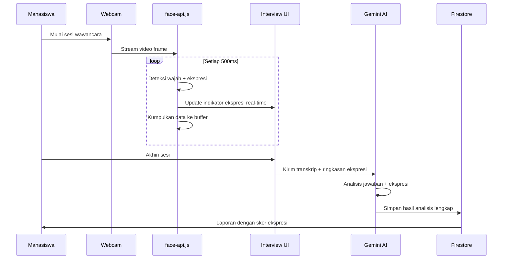

# Fitur Analisis Ekspresi Wajah — Intervox

Judul baru skripsi: **"Sistem Cerdas Virtual Interview Coach Berbasis AI dengan Fitur Analisis Ekspresi, Jawaban, dan Penilaian Wawancara Mahasiswa"**

Menambahkan fitur **analisis ekspresi wajah real-time** selama sesi wawancara menggunakan webcam + AI. Ekspresi wajah (gugup, percaya diri, netral, dll.) direkam sepanjang sesi dan dijadikan salah satu komponen penilaian.

## Proposed Changes

### Pendekatan Teknis

Menggunakan **`@vladmandic/face-api`** (maintained fork dari face-api.js) yang berjalan **sepenuhnya di browser (client-side)**:

| Aspek | Detail |
|-------|--------|
| Library | `@vladmandic/face-api` (npm) |
| Model | `TinyFaceDetector` + `FaceExpressionNet` |
| Eksekusi | Client-side via TensorFlow.js di browser |
| Input | Webcam stream (sudah ada via `getUserMedia`) |
| Output | 7 ekspresi: `neutral`, `happy`, `sad`, `angry`, `fearful`, `disgusted`, `surprised` |
| Frekuensi | Deteksi setiap ~500ms selama sesi berlangsung |
| Penyimpanan | Agregat summary + snapshot per-pertanyaan disimpan ke Firestore |

> [!IMPORTANT]
> Library ini gratis, open-source, dan berjalan 100% di browser — tidak perlu cloud API tambahan. Model weights (~5MB) diletakkan di folder `public/models/`.

---

### Alur Kerja Fitur



---

### Komponen yang Diubah/Dibuat

#### 1. Hook Baru: Deteksi Ekspresi

##### [NEW] [use-face-expression.ts](file:///Users/gustiranda/Works/Skripsi/intervai/hooks/use-face-expression.ts)

Custom React hook yang mengelola seluruh lifecycle deteksi ekspresi wajah:

- Load model face-api.js saat mount
- Buat hidden `<video>` element dari webcam stream
- Jalankan deteksi ekspresi setiap ~500ms menggunakan `requestAnimationFrame` + throttle
- Kumpulkan data ekspresi ke buffer array
- Expose state: `currentExpression`, `expressionHistory`, `isModelLoaded`, `isCameraActive`
- Expose method: `startDetection(stream)`, `stopDetection()`, `getExpressionSummary()`

`getExpressionSummary()` menghasilkan:
```typescript
{
  dominantExpression: 'neutral',        // ekspresi paling sering
  expressionDistribution: {             // persentase masing-masing
    neutral: 45.2,
    happy: 22.1,
    fearful: 15.3,
    surprised: 10.5,
    sad: 4.2,
    angry: 1.9,
    disgusted: 0.8
  },
  confidenceScore: 72,                  // skor kepercayaan diri (0-100)
  nervousnessIndicator: 28,             // indikator gugup (0-100)
  totalFramesAnalyzed: 180,
  snapshots: [                          // ekspresi per segmen waktu
    { timestamp: 1234567890, dominant: 'neutral', scores: {...} },
    ...
  ]
}
```

---

#### 2. Halaman Interview Session (Modifikasi)

##### [MODIFY] [page.tsx](file:///Users/gustiranda/Works/Skripsi/intervai/app/interview/session/page.tsx)

Perubahan:
- **Import** hook `useFaceExpression`
- **Video preview** kecil di sudut layar menampilkan wajah mahasiswa + overlay ekspresi terdeteksi
- **Indikator real-time** kecil di samping AI avatar yang menunjukkan ekspresi dominan saat ini (emoji + label)
- **Saat sesi berakhir**: Ambil `getExpressionSummary()` dan sertakan dalam data yang dikirim ke Gemini untuk analisis
- **Modifikasi prompt analisis**: Tambahkan data ekspresi ke prompt Gemini agar menghasilkan skor ekspresi

Tampilan baru di UI session:
```
┌─────────────────────────────────────────────────┐
│  [Header: Interview Session]                     │
├──────────────────────┬──────────────────────────-│
│                      │                           │
│    AI Avatar         │   Live Transcript         │
│    ○ Pulsing         │                           │
│                      │   Interviewer: ...        │
│  ┌──────────┐        │   You: ...                │
│  │ 📷 Webcam │        │                           │
│  │ Preview   │        │                           │
│  │ 😊 Happy  │        │                           │
│  └──────────┘        │                           │
│                      │                           │
│  Ekspresi: 😊 Percaya Diri                       │
│  ████████░░ 78%      │                           │
├──────────────────────┴──────────────────────────-│
│  [Mute] [End Interview]                          │
└─────────────────────────────────────────────────-│
```

---

#### 3. Integrasi Analisis AI (Modifikasi)

##### [MODIFY] [page.tsx](file:///Users/gustiranda/Works/Skripsi/intervai/app/interview/session/page.tsx) — Bagian `confirmEndInterview`

Prompt analisis Gemini dimodifikasi untuk menyertakan data ekspresi:
```
Analisis data ekspresi wajah kandidat selama sesi:
- Ekspresi dominan: neutral (45%), happy (22%), fearful (15%)
- Indikator kepercayaan diri: 72%
- Indikator kegugupan: 28%

Berdasarkan data ekspresi DAN jawaban, berikan:
- expressionScore (0-100): seberapa baik ekspresi non-verbal kandidat
- confidenceLevel: "tinggi"/"sedang"/"rendah"
- expressionFeedback: saran perbaikan bahasa tubuh
```

Schema JSON response ditambah:
```typescript
scores: {
  communication: number,
  technical: number,
  problemSolving: number,
  cultureFit: number,
  expression: number,        // BARU
}
expressionAnalysis: {         // BARU
  confidenceLevel: string,
  expressionFeedback: string,
  dominantExpression: string,
}
```

---

#### 4. Data Service (Modifikasi)

##### [MODIFY] [data-service.ts](file:///Users/gustiranda/Works/Skripsi/intervai/lib/data-service.ts)

- `createSession` & `updateSession`: tambah field `expressionData` (JSON object berisi summary ekspresi)
- `saveAnalysisResult`: tambah field `expressionScore`, `expressionAnalysis`
- Scoring formula diupdate: rata-rata 5 dimensi (communication, technical, problemSolving, cultureFit, **expression**)

---

#### 5. Model File (Baru)

##### [NEW] `public/models/` directory

Download dan letakkan model weights face-api.js:
- `tiny_face_detector_model-weights_manifest.json` + shard
- `face_expression_model-weights_manifest.json` + shard

Total ukuran ~5MB, diload saat user pertama kali buka halaman interview.

---

#### 6. Next.js Config (Modifikasi)

##### [MODIFY] [next.config.ts](file:///Users/gustiranda/Works/Skripsi/intervai/next.config.ts)

Tambah webpack config untuk mengatasi SSR issues:
```typescript
webpack: (config, { isServer }) => {
  if (isServer) {
    config.externals.push('canvas');
  }
  return config;
}
```

---

#### 7. Laporan Ekspresi (Baru)

##### [NEW] Laporan ke-11: Laporan Analisis Ekspresi Wajah

Halaman report baru `/reports/expression-analysis` yang menampilkan:
- Grafik distribusi ekspresi selama sesi (pie chart / bar chart)
- Timeline ekspresi sepanjang wawancara
- Skor kepercayaan diri dan kegugupan
- Saran perbaikan bahasa tubuh dari AI
- Perbandingan antar sesi (jika ada riwayat)

---

### Perubahan Database

#### Tabel `sesi_wawancara` (interview_sessions) — field baru:

| Field | Type | Keterangan |
|-------|------|------------|
| `expressionData` | JSON | Ringkasan ekspresi wajah selama sesi |

#### Tabel `hasil_analisis` (analysis_results) — field baru:

| Field | Type | Keterangan |
|-------|------|------------|
| `expressionScore` | DECIMAL(5,2) | Skor ekspresi wajah (0-100) |
| `confidenceLevel` | VARCHAR(20) | tinggi/sedang/rendah |
| `expressionFeedback` | TEXT | Saran perbaikan bahasa tubuh |
| `dominantExpression` | VARCHAR(30) | Ekspresi paling sering terdeteksi |

---

## User Review Required

> [!IMPORTANT]
> **Izin Webcam**: Fitur ini memerlukan akses kamera. Saat ini Intervox hanya minta izin mikrofon. Setelah fitur ini diterapkan, pop-up izin browser akan meminta **kamera + mikrofon** sekaligus. Apakah ini OK?

> [!IMPORTANT]
> **Jumlah Laporan**: Dospem lo minta 10 laporan. Dengan tambahan Laporan Analisis Ekspresi, jadi **11 laporan**. Opsi:
> 1. Tambah jadi 11 laporan (lebih banyak = lebih bagus buat skripsi)
> 2. Gabungkan laporan ekspresi ke dalam Laporan Hasil Evaluasi Skor yang sudah ada
>
> Mana yang lo prefer?

> [!WARNING]
> **Performa**: Deteksi ekspresi di browser butuh processing power. Di laptop low-end, mungkin agak berat kalau jalan bareng voice AI. Gw akan implementasi throttle (deteksi setiap 500ms, bukan per frame) untuk menjaga performa tetap smooth.

## Open Questions

1. **Preview webcam**: Mau ditampilin preview video wajah lo di layar interview, atau cukup indikator ekspresi aja (tanpa video preview)?
2. **Bahasa feedback ekspresi**: Mau bahasa Indonesia atau Inggris untuk feedback ekspresi dari AI?

## Verification Plan

### Automated Tests
- Test hook `useFaceExpression` dengan mock webcam stream
- Test kalau data ekspresi tersimpan dengan benar ke Firestore
- Test kalau skor overall sudah include `expression` score (rata-rata 5 dimensi)

### Manual Verification
- Buka halaman interview session → pastikan webcam aktif dan ekspresi terdeteksi
- Jalankan sesi wawancara penuh → pastikan data ekspresi muncul di laporan
- Cek performa di Chrome DevTools → pastikan tidak ada frame drop signifikan
