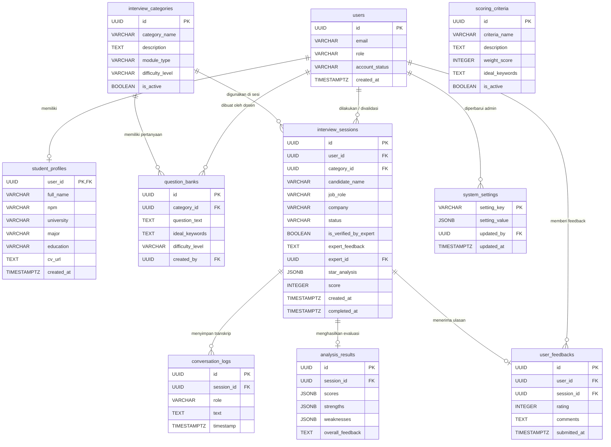
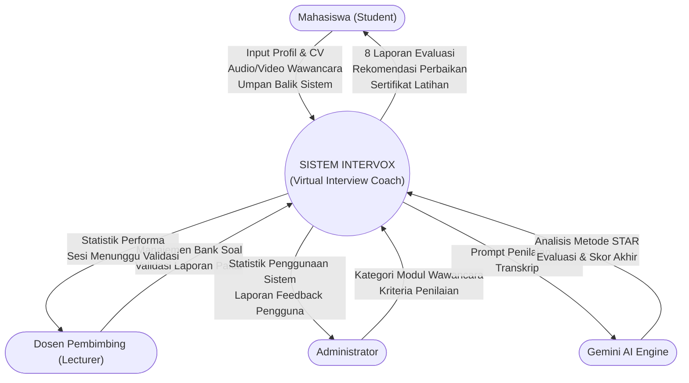

# 1. Judul Penelitian
**“Sistem Cerdas Virtual Interview Coach Berbasis AI dengan Fitur Analisis Ekspresi, Jawaban, dan Penilaian Wawancara Mahasiswa”**

# 2. Proses Sistem pada Judul yang Dibahas
Sistem **Intervox** bertindak sebagai platform simulasi wawancara bagi mahasiswa yang bersiap memasuki dunia kerja. Proses utamanya meliputi:

1. **Onboarding & Profiling**: Mahasiswa mendaftar dan melengkapi profil akademik (NPM, Jurusan, Pendidikan, dan CV).
2. **Konfigurasi Simulasi**: Mahasiswa menentukan posisi pekerjaan yang dilamar, perusahaan tujuan, dan tingkat kesulitan wawancara.
3. **Wawancara Real-time (Voice & Expression)**: Sistem AI (berperan sebagai HRD/Interviewer) memberikan pertanyaan secara lisan, dan mahasiswa menjawab menggunakan mikrofon (Voice-to-Voice). Pertanyaan AI dipandu oleh Bank Soal (Question Banks) yang disiapkan oleh Dosen Pembimbing. Sistem juga merekam ekspresi wajah menggunakan webcam.
4. **Analisis AI**: Sistem merangkum seluruh transkrip percakapan, lalu mengevaluasi jawaban mahasiswa berdasarkan *Scoring Criteria* (Kemampuan Komunikasi, Teknis, Problem Solving, dan Culture Fit).
5. **Pelaporan Terpusat (Primary Data)**: Sistem menghasilkan dokumen laporan hasil evaluasi wawancara (PDF) yang dilengkapi kop surat kampus dan kolom tanda tangan Dosen Pembimbing.
6. **Pemantauan Dosen**: Dosen Pembimbing dapat memantau statistik perkembangan, kelemahan, dan skor mahasiswa bimbingannya melalui dasbor khusus, tanpa bisa mengubah hak akses sistem (yang dikontrol oleh Admin).

# 3. Masalah pada Penelitian
- **Kurangnya Wadah Latihan Realistis**: Mahasiswa tingkat akhir sering kali kurang siap menghadapi wawancara kerja karena minimnya pengalaman dan tidak adanya simulasi dua arah yang interaktif (termasuk tekanan dari interaksi langsung).
- **Keterbatasan Waktu Dosen Pembimbing**: Mustahil bagi dosen pembimbing atau pusat karir kampus untuk mensimulasikan wawancara secara tatap muka kepada ratusan mahasiswa satu per satu secara rutin.
- **Evaluasi Subjektif & Tidak Terukur**: Sulit untuk mendapatkan metrik penilaian yang objektif mengenai kesiapan wawancara seorang mahasiswa yang dapat dijadikan tolok ukur standar kelulusan pelatihan.

# 4. Stakeholder (Pengguna) dan Fungsinya
Sistem ini dirancang untuk mempermudah proses sesuai dengan keadaan lapangan, dengan 3 pengguna utama:

1. **Mahasiswa (Student)**
   - **Fungsi:** Sebagai pengguna akhir (peserta) yang melakukan pelatihan wawancara.
   - **Kegunaan:** Mengisi data profil, melakukan simulasi wawancara suara dan ekspresi, melihat evaluasi performa, serta mencetak laporan bukti simulasi.
2. **Dosen Pembimbing / Penguji (Lecturer)**
   - **Fungsi:** Sebagai pemantau dan fasilitator akademik.
   - **Kegunaan:** Memantau daftar mahasiswa bimbingan, melihat hasil skor setiap simulasi, mengelola Question Banks (Bank Soal) untuk digunakan AI, dan memvalidasi laporan akhir mahasiswa.
3. **Administrator (Admin)**
   - **Fungsi:** Sebagai pengelola sistem penuh.
   - **Kegunaan:** Mengelola kategori modul wawancara, mengatur kriteria penilaian utama (Scoring Criteria), memverifikasi pengguna baru, serta mengatur profil pengesahan dokumen.

# 5. Perancangan Penelitian

## A. Tabel Database

### 1. Tabel `users`
Tabel bawaan autentikasi untuk menyimpan kredensial dan hak akses pengguna.

| Nama Field | Tipe Data | Keterangan |
| :--- | :--- | :--- |
| `id` | UUID | Primary Key, di-generate otomatis |
| `email` | VARCHAR | Alamat email pengguna |
| `role` | VARCHAR | Hak akses (student, lecturer, administrator) |
| `account_status` | VARCHAR | Status akun (pending, approved, rejected) |
| `created_at` | TIMESTAMPTZ | Waktu pendaftaran akun |

### 2. Tabel `student_profiles`
Tabel untuk menyimpan data profil lengkap mahasiswa (terhubung relasi 1:1 dengan `users`).

| Nama Field | Tipe Data | Keterangan |
| :--- | :--- | :--- |
| `user_id` | UUID | Primary Key, Foreign Key ke tabel users |
| `full_name` | VARCHAR | Nama lengkap mahasiswa |
| `npm` | VARCHAR(20) | Nomor Pokok Mahasiswa (NPM) |
| `university` | VARCHAR | Nama institusi (Default: UNISKA) |
| `major` | VARCHAR | Program studi / Jurusan |
| `education` | VARCHAR | Tingkat pendidikan (S1, D3, dll) |
| `cv_url` | TEXT | Tautan dokumen CV mahasiswa |
| `created_at` | TIMESTAMPTZ | Waktu profil dibuat |

### 3. Tabel `interview_categories`
Tabel master untuk menyimpan kategori modul wawancara yang tersedia.

| Nama Field | Tipe Data | Keterangan |
| :--- | :--- | :--- |
| `id` | UUID | Primary Key |
| `category_name` | VARCHAR(100) | Nama kategori wawancara |
| `description` | TEXT | Deskripsi modul wawancara |
| `module_type` | VARCHAR(50) | Tipe wawancara (Profesional, Akademik, dll) |
| `difficulty_level` | VARCHAR(20) | Tingkat kesulitan default (easy, medium, hard) |
| `is_active` | BOOLEAN | Status modul (Aktif/Nonaktif) |

### 4. Tabel `question_banks`
Tabel untuk menyimpan daftar pertanyaan yang dibuat oleh dosen untuk modul tertentu.

| Nama Field | Tipe Data | Keterangan |
| :--- | :--- | :--- |
| `id` | UUID | Primary Key |
| `category_id` | UUID | Foreign Key ke tabel interview_categories |
| `question_text` | TEXT | Teks pertanyaan wawancara yang akan ditanyakan AI |
| `ideal_keywords` | TEXT | Kata kunci ideal yang diharapkan dijawab oleh mahasiswa |
| `difficulty_level` | VARCHAR(20) | Tingkat kesulitan spesifik pertanyaan tersebut |
| `created_by` | UUID | Foreign Key ke users (dosen pembuat soal) |

### 5. Tabel `scoring_criteria`
Tabel master untuk parameter penilaian evaluasi wawancara oleh AI.

| Nama Field | Tipe Data | Keterangan |
| :--- | :--- | :--- |
| `id` | UUID | Primary Key |
| `criteria_name` | VARCHAR(100) | Nama kriteria (contoh: Communication, Technical) |
| `description` | TEXT | Penjelasan detail mengenai kriteria tersebut |
| `weight_score` | INTEGER | Bobot persentase nilai (1-100) |
| `ideal_keywords` | TEXT | Kata kunci yang dicari AI untuk memberi nilai tinggi |
| `is_active` | BOOLEAN | Status kriteria |

### 6. Tabel `interview_sessions`
Tabel transaksi untuk merekam setiap sesi wawancara mahasiswa.

| Nama Field | Tipe Data | Keterangan |
| :--- | :--- | :--- |
| `id` | UUID | Primary Key |
| `user_id` | UUID | Foreign Key ke users (mahasiswa) |
| `category_id` | UUID | Foreign Key ke interview_categories |
| `candidate_name` | VARCHAR | Nama kandidat saat wawancara dilakukan |
| `job_role` | VARCHAR | Posisi pekerjaan yang dilamar |
| `company` | VARCHAR | Nama perusahaan tujuan |
| `status` | VARCHAR | Status wawancara (in-progress, analyzing, pending-verification, completed) |
| `is_verified_by_expert` | BOOLEAN | Status validasi dosen/pakar |
| `expert_feedback` | TEXT | Catatan manual dari dosen/pakar |
| `expert_id` | UUID | Foreign Key ke users (dosen yang memvalidasi) |
| `star_analysis` | JSONB | Hasil analisis evaluasi dengan Metode STAR |
| `score` | INTEGER | Nilai akhir keseluruhan sesi |
| `created_at` | TIMESTAMPTZ | Waktu sesi dimulai |
| `completed_at` | TIMESTAMPTZ | Waktu sesi selesai |

### 7. Tabel `conversation_logs`
Tabel untuk menyimpan rekaman transkrip kata demi kata selama wawancara berlangsung.

| Nama Field | Tipe Data | Keterangan |
| :--- | :--- | :--- |
| `id` | UUID | Primary Key |
| `session_id` | UUID | Foreign Key ke interview_sessions |
| `role` | VARCHAR(20) | Siapa yang berbicara (ai atau user) |
| `text` | TEXT | Teks ucapan hasil transkripsi |
| `timestamp` | TIMESTAMPTZ | Waktu teks diucapkan |

### 8. Tabel `analysis_results`
Tabel untuk menyimpan hasil kesimpulan dan evaluasi AI dari suatu sesi wawancara.

| Nama Field | Tipe Data | Keterangan |
| :--- | :--- | :--- |
| `id` | UUID | Primary Key |
| `session_id` | UUID | Foreign Key ke interview_sessions |
| `scores` | JSONB | Data nilai per metrik penilaian |
| `strengths` | JSONB | Array kumpulan kelebihan kandidat berdasarkan AI |
| `weaknesses` | JSONB | Array kumpulan area perbaikan (kekurangan) kandidat |
| `overall_feedback` | TEXT | Umpan balik teks secara keseluruhan |

### 9. Tabel `system_settings`
Tabel untuk menyimpan pengaturan aplikasi secara umum (seperti profil dosen pengesah dokumen).

| Nama Field | Tipe Data | Keterangan |
| :--- | :--- | :--- |
| `setting_key` | VARCHAR(100) | Primary Key, Kunci pengaturan unik |
| `setting_value` | JSONB | Nilai pengaturan (seperti data nama dan NIP pengesah) |
| `updated_by` | UUID | Foreign Key ke users (admin yang mengubah) |
| `updated_at` | TIMESTAMPTZ | Waktu terakhir diperbarui |

### 10. Tabel `user_feedbacks`
Tabel untuk menyimpan rating kepuasan dan komentar dari mahasiswa terhadap sistem.

| Nama Field | Tipe Data | Keterangan |
| :--- | :--- | :--- |
| `id` | UUID | Primary Key |
| `user_id` | UUID | Foreign Key ke tabel users |
| `session_id` | UUID | Foreign Key ke tabel interview_sessions |
| `rating` | INTEGER | Skor penilaian 1 sampai 5 |
| `comments` | TEXT | Saran, kritik, atau komentar pengguna |
| `submitted_at` | TIMESTAMPTZ | Waktu umpan balik dikirimkan |

## B. Tabel Relasi Database (ERD)
Berikut adalah struktur relasi tabel dalam database Supabase. Perhatikan bahwa role pada tabel `users` kini hanya menerima `student`, `lecturer`, atau `administrator`.

## C. Diagram Konteks (Context Diagram)
Diagram konteks menunjukkan aliran data utama antara sistem dan entitas luar.

# 6. Laporan Apa Saja yang Dihasilkan?
Untuk memenuhi kriteria “menghasilkan laporan bersifat primary”, aplikasi dapat memproduksi (dan mengekspor ke PDF) laporan-laporan berikut:

1. **Laporan Transkrip Wawancara (Transcript Report)**
   Berisi riwayat percakapan lengkap antara AI dan Mahasiswa kata demi kata (word-by-word), mencakup pertanyaan AI dan jawaban mahasiswa beserta catatan waktu (timestamp).
2. **Laporan Evaluasi Skor (Score Evaluation)**
   Menyajikan nilai akhir kandidat dalam bentuk angka, yang dibreakdown menjadi metrik Komunikasi, Teknis, Pemecahan Masalah, dan Culture Fit, lengkap dengan nilai analisis ekspresi wajah.
3. **Laporan Kelebihan & Kelemahan (Strength & Weakness)**
   Hasil ekstraksi AI mengenai sisi positif kandidat dan area-area spesifik yang harus diperbaiki untuk wawancara sesungguhnya.
4. **Laporan Perbandingan Jawaban (Answer Comparison)**
   Laporan tabel yang membandingkan “Jawaban Aktual Mahasiswa” versus “Patokan Jawaban Ideal / Ideal Keywords” dari Bank Soal Dosen.
5. **Laporan Rekap Performa Keseluruhan**
   Rekapitulasi resmi mengenai total skor dan progres dari seluruh sesi latihan mahasiswa (sesuai arahan panelis).
6. **Laporan Statistik Penggunaan Sistem**
   Laporan data jumlah sesi per periode, waktu latihan rata-rata, dan fitur atau modul yang paling sering digunakan.
7. **Laporan Feedback Pengguna Terhadap Sistem**
   Laporan yang memuat daftar umpan balik (rating dan saran) dari mahasiswa sebagai bahan perbaikan sistem ke depannya.
8. **Sertifikat Pelatihan Wawancara (Certificate)**
   Sertifikat digital resmi berbintang yang memuat NPM, Nama, dan Predikat kelulusan (Sangat Baik / Baik / Perlu Peningkatan).

*(Seluruh cetak laporan di atas akan otomatis menyematkan Kop Surat universitas/lembaga dan kolom tanda tangan pengesahan dari Dosen Pembimbing di bagian bawah dokumen).*
